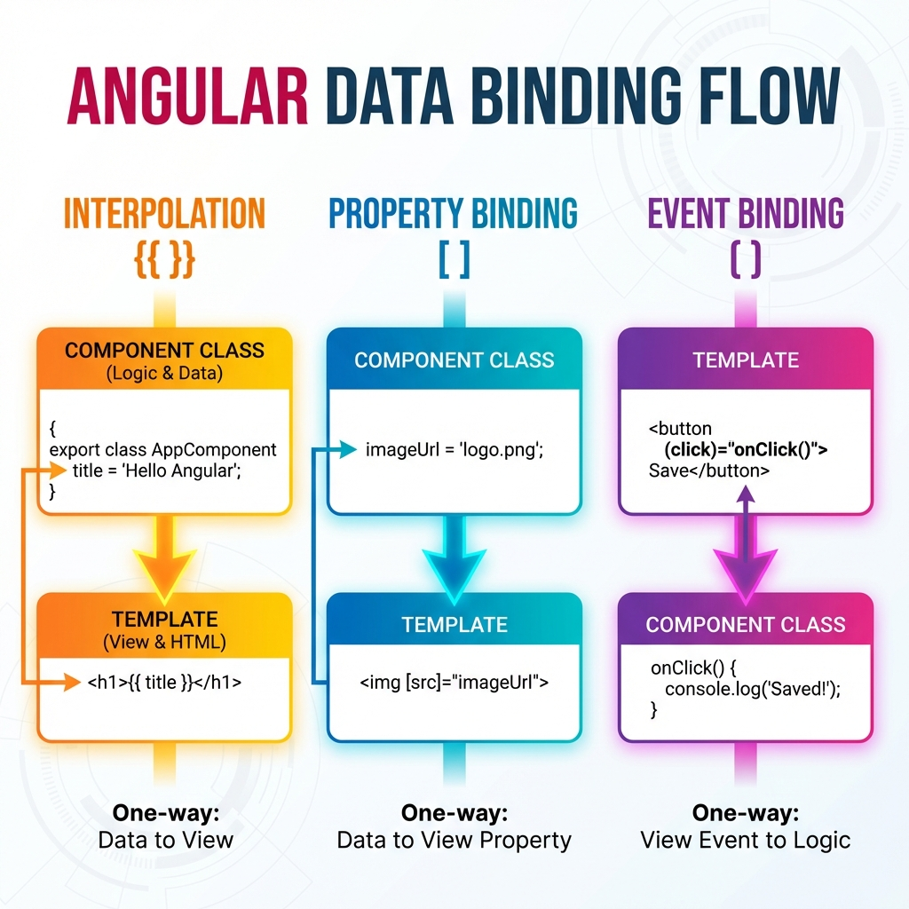
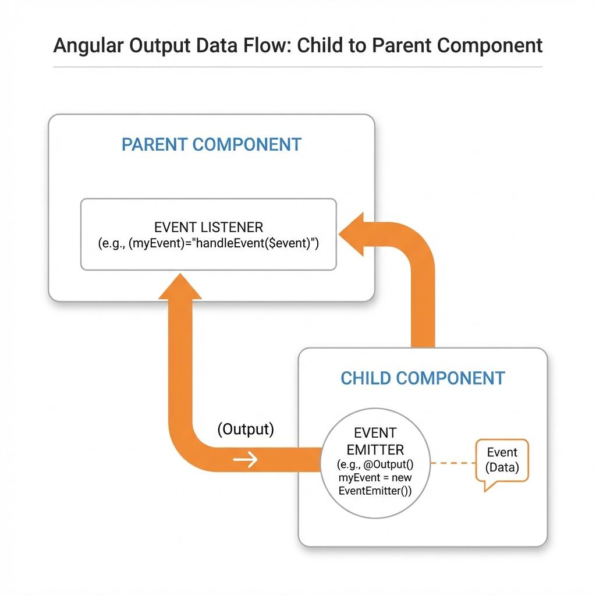
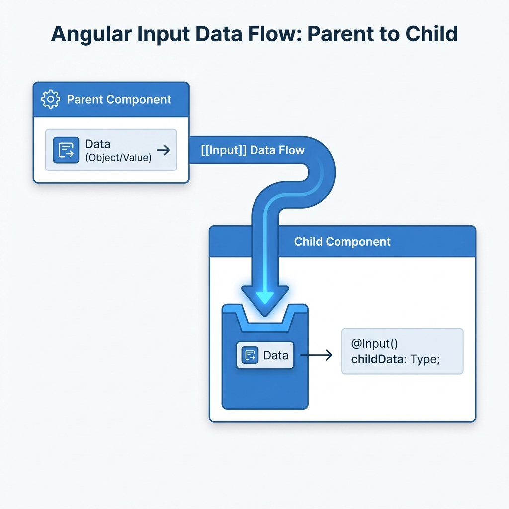

# Angular Mastery: Comprehensive Course Notes 🚀

This repository tracks my journey through the **Angular - The Complete Guide** course. It contains hands-on projects, detailed architectural notes, and deep dives into modern Angular features like Signals and standalone components.


---

## 🛠️ Getting Started

This project was generated using [Angular CLI](https://github.com/angular/angular-cli) version 21.1.0.

### Development Server

Run `ng serve` for a dev server. Navigate to `http://localhost:4200/`. The app will automatically reload if you change any of the source files.

### Useful Commands

| Task                   | Command                      |
| :--------------------- | :--------------------------- |
| **Start Server**       | `ng serve`                   |
| **Build Project**      | `ng build`                   |
| **Run Unit Tests**     | `ng test`                    |
| **Run E2E Tests**      | `ng e2e`                     |
| **Generate Component** | `ng generate component name` |

---

## 📚 Course Progress & Learning Path

- [x] **Introduction to Angular**: A TypeScript-based framework by Google for building scalable Single-Page Applications (SPAs).
- [x] **Angular Architecture**: Organizing apps using components, templates, and services with a focus on modularity and dependency injection.

### 📁 Project Structure Deep Dive

#### TypeScript Configuration

1. `tsconfig.json`: Global TypeScript compiler configuration.
2. `tsconfig.app.json`: Specific configuration for the Angular application.
3. `tsconfig.spec.json`: Configuration for unit tests.

#### Core Configuration Files

- `angular.json`: The heart of project configuration. Used to define build targets, assets, and global styles/scripts (e.g., Bootstrap, Tailwind CSS).
- `.gitignore`: Specifies files for Git to ignore (e.g., `node_modules`, `.env`).
- `package.json`: Manages project dependencies and scripts.
- `editorconfig`: Maintains consistent coding styles across different editors.

#### Source Directory (`src`)

- `index.html`: The main HTML file where the app is rendered.
- `main.ts`: The entry point that bootstraps the `AppModule` or standalone component.
- `styles.css`: Global application styles.
- `app/`: Contains the core application logic, components, and routing.

---

## 🏗️ Components & Templates

Components are the fundamental building blocks of Angular. Each component typically consists of:

- **Logic**: `component.ts` (Class & Metadata)
- **View**: `component.html` (Structure)
- **Styles**: `component.css` (Look & Feel)
- **Tests**: `component.spec.ts` (Unit Testing)

> [!TIP]
> Use the `@Component` decorator to define a class as an Angular component. It metadata links the logic to the template and styles.

```typescript
import { Component } from '@angular/core';

@Component({
  selector: 'app-user',
  templateUrl: './user.component.html',
  styleUrls: ['./user.component.css'],
  standalone: true,
  imports: [], // Add dependencies here
})
export class UserComponent {
  // Logic goes here
}
```

---

## 🔄 Data Binding & Interaction



Angular provides powerful ways to sync data between your logic and the UI:

### 1. Interpolation `{{ }}`

Used to display dynamic data from the component class in the HTML template.

```html
<h1>{{ title }}</h1>
```

### 2. Property Binding `[ ]`

Binds a component property to a DOM element attribute or directive.

```html
<h1 [title]="title"></h1>

```

### 3. Event Binding `( )`

Captures user interactions (like clicks) and executes logic in the component.

```html
<button (click)="onSelectUser()">Select User</button>
```

### 4. Getters & Setters in Data Binding

Getters and setters are standard OOP features used to encapsulate logic when reading or writing a property. In Angular, **getters** are incredibly useful for returning computed or dynamic values to the template.

> [!TIP]
> From the template's perspective, a getter is used just like a normal property (no parentheses are needed).

```typescript
export class AppComponent {
  private _userCount = 0;

  // Getter used as a property in HTML
  get userCountDisplay(): string {
    return `Total Users: ${this._userCount}`;
  }
}
```

```html
<!-- No parentheses needed for getters! -->
<h2>{{ userCountDisplay }}</h2>
```

---

## ⚡ Angular Signals & Change Detection


### The Reactive Revolution

Angular uses **Zone.js** by default to detect changes. However, **Signals** (introduced in Angular 16) provide a more granular and efficient way to track state.

> [!NOTE]
> A **Signal** is a "trackable data container" that notifies Angular exactly when its value changes, allowing for targeted UI updates.

> [!NOTE]
> A **Signal** is an object that stores a value (any type of value including nested objects).

> [!NOTE]
> A **Angular** Angular manages subscriptions to the signal to get notified about values changes

> [!NOTE]
> A **Computed Signal** is a "read-only, derived state" that is computed from other signals.

#### Working with Signals

```typescript
import { signal, computed } from '@angular/core';

// 1. Initialize
const userName = signal('Ahmed');

// 2. Update (using previous value)
userName.update((prev) => prev + ' Master');

// 3. Set (direct update)
userName.set('Mohamed');

// 4. Computed Signals (read-only, derived state)
const upperName = computed(() => userName().toUpperCase());
```

---

### 📥 Receiving Data: The @Input Decorator & Signals

Imagine a component is like a small robot 🤖. To do its job, sometimes it needs information from its boss (the Parent Component).

#### 1. The Classic Way: `@Input()`

We use the `@Input()` decorator to create a "hole" or "slot" where data can be plugged in from the outside.

```typescript
// Standard input
@Input() name!: string;

// Mandatory input (The robot MUST have this to work!)
// If the parent forgets this, the app will complain! ❌
@Input({ required: true }) avatar!: string;
```

#### 2. The Modern Way: `input()` Signals ⚡

Angular recently introduced a cooler way to handle inputs using **Signals**.

```typescript
// Mandatory input using Signals
name = input.required<string>();

// Input with a default value
avatar = input<string>('default-image.png');
```

**Understanding Signal Inputs:**

- **Read-Only**: Unlike standard variables, you **cannot** refresh a signal input manually using `.set()` or `.update()`. It only change when the parent sends new data! 🛡️
- **Reactive**: The app knows exactly when the value changes, making it super fast.

#### 3. Sending Data Back: The `@Output()` Decorator 📢

If `@Input` is about receiving a gift, `@Output` is about **sending a signal** when something happens!

**The Doorbell Analogy:**
Imagine the Child component is a visitor at the Parent's house.

- The visitor (Child) doesn't just walk in.
- Instead, they press a **Doorbell (The Event)**.
- The Parent hears the doorbell and decides what to do! 🚪🔔

**How it works in code:**

1. **Child Side**: We create an `EventEmitter`.

```typescript
@Output() selectUser = new EventEmitter<string>();

onSelectUser() {
  this.selectUser.emit(this.id); // "Ding Dong! Here is the ID!"
}
```

2. **Parent Side**: We "listen" for that event using parentheses `()`.

```html
<app-user (selectUser)="onSelectUser($event)" />
```

> [!NOTE]
> **$event** is a special keyword. It holds the "data" that the child sent (in this case, the User ID).

---

### 🔄 Summary: How Data Moves

| Feature    | Direction       | Symbol | Real-life Example                   |
| :--------- | :-------------- | :----- | :---------------------------------- |
| **Input**  | Parent ➡️ Child | `[ ]`  | Postman giving you mail 📬          |
| **Output** | Child ➡️ Parent | `( )`  | Pressing a doorbell to say "Hi!" 🔔 |


_Inputs go IN [ ], Outputs go OUT ( )_

---

#### 4. Transforming Data: Getters vs computed() 🛠️

Sometimes we need to change the data before showing it (like adding a file path to an image name).

| Technique    | Example                                         | Best For                 |
| :----------- | :---------------------------------------------- | :----------------------- |
| **Getter**   | `get path() { return 'img/' + this.avatar; }`   | Classic `@Input`         |
| **Computed** | `path = computed(() => 'img/' + this.avatar())` | Modern `input()` Signals |

**Why `computed()` is better?**
It only runs when its dependencies (the signals inside it) change. A getter runs much more often, which can slow down huge apps! 🐢 -> 🚀


_Data flows from the Parent into the Child "Mailbox"_

---

## 🛠️ Advanced Concepts

- [x] **Directives**: Manipulate the DOM structure or behavior.
- [x] **Services**: Encapsulate shared business logic and data.
- [x] **Dependency Injection**: Efficiently provide services to components.
- [x] **Routing**: Manage navigation between views.
- [x] **RxJS**: Handle asynchronous data streams with Observables.
- [x] **HTTP Client**: Seamlessly make API requests.
- [x] **Testing & Deployment**: Finalizing and shipping the app.

---

_Notes inspired by Maximilian Schwarzmüller's Angular Course._
