> [!IMPORTANT]
> **Critical Note for AI Assistants**: Never remove or replace old explanations in this file. Always append new data, steps, and pedagogical questions to support the existing content. Preserve the "Senior to Junior" teaching structure. Additionally, ensure every explanation includes a code example, even within the step-by-step guides. For specific projects, explain every step and the "WHY" behind it (e.g., Why use a Service? Why use Signals?). After documenting, delete pedagogical comments from source files ONLY after pushing the documentation to GitHub to ensure it is permanently saved.

# Angular Mastery: Senior Architect's Handbook 🚀

> **Part 1: Foundations & Reactive Architecture**

This repository is more than just a course tracker; it's a blueprint for building scalable, enterprise-grade Angular applications. Here, we transition from basic component creation to senior-level architectural patterns, emphasizing **Signals**, **Signal-based I/O**, and **Clean Service Architecture**.


---

## 🗺️ Part 1 Roadmap: The Reactive Core

In this first phase, we focus on mastering the "Reactive Flow." A senior developer doesn't just make things work; they make them **efficient**, **predictable**, and **modular**.

---

## 🛠️ Getting Started

This project was generated using [Angular CLI](https://github.com/angular/angular-cli) version 21.1.0.

### Development Server

Run `ng serve` for a dev server. Navigate to `http://localhost:4200/`. The app will automatically reload if you change any of the source files.

### Useful Commands

| Task                   | Command                      |
| :--------------------- | :--------------------------- |
| **Start Server**       | `ng serve`                   |
| **Build Project**      | `ng build`                   |
| **Run Unit Tests**     | `ng test`                    |
| **Run E2E Tests**      | `ng e2e`                     |
| **Generate Component** | `ng generate component name` |

---

## 🏛️ Angular Architecture & Design Patterns — Senior Deep Dive

> [!IMPORTANT]
> This section documents the **architectural backbone** of Angular — the patterns that every senior developer must be able to name, draw, and explain in an interview.

---

### 🎯 Pattern 1: MVVM — Model · View · ViewModel

> **Official Reference**: [Angular Docs — Components Overview](https://angular.dev/guide/components)

Angular is built on the **MVVM (Model-View-ViewModel)** pattern. Every file you write maps to one of three layers.

| Layer | Angular File | Responsibility |
|:--|:--|:--|
| **Model** | `service.ts` + `signal()` | Owns data and business logic. Zero knowledge of UI. |
| **ViewModel** | `component.ts` | Bridge: reads from Model, exposes data to View via bindings. |
| **View** | `component.html` | Pure display. Knows nothing about where data comes from. |

#### Why MVVM and not MVC?

In classic **MVC**, the Controller manually pushes data into the View — **imperative**. In **MVVM**, the ViewModel exposes reactive state and the View updates itself automatically — **declarative**. Angular's `signal()`, `computed()`, and `[(ngModel)]` implement this reactive contract.

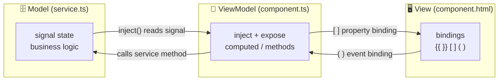
```mermaid
graph LR
    subgraph M ["🗄️ Model (service.ts)"]
        S["signal state\nbusiness logic"]
    end
    subgraph VM ["🧠 ViewModel (component.ts)"]
        C["inject + expose\ncomputed / methods"]
    end
    subgraph V ["🖥️ View (component.html)"]
        T["bindings\n{{ }} [ ] ( )"]
    end

    S -- "inject() reads signal" --> C
    C -- "[ ] property binding" --> T
    T -- "( ) event binding" --> C
    C -- "calls service method" --> S
```

> **Reading the diagram**: Green arrows carry **data** (Model → ViewModel → View). Orange arrows carry **commands** back (user events flow View → ViewModel → Model). The cycle is continuous and reactive.

#### Code: All Three Layers Together

```typescript
// ── LAYER 1: MODEL ──────────────────────────────────
@Injectable({ providedIn: 'root' })
export class TaskService {
  private _tasks = signal<Task[]>([]);
  tasks = this._tasks.asReadonly();          // expose read-only

  addTask(task: Task)   { this._tasks.update(p => [task, ...p]); }
  removeTask(id: string){ this._tasks.update(p => p.filter(t => t.id !== id)); }
}

// ── LAYER 2: VIEWMODEL ───────────────────────────────
@Component({ selector: 'app-task-list', ... })
export class TaskListComponent {
  private taskService = inject(TaskService);   // inject the Model

  tasks     = this.taskService.tasks;          // expose to View
  taskCount = computed(() => this.tasks().length);

  onDelete(id: string) {
    this.taskService.removeTask(id);           // ViewModel → Model
  }
}

// ── LAYER 3: VIEW (template) ─────────────────────────
// <p>Total: {{ taskCount() }}</p>
// <div *ngFor="let task of tasks()">
//   {{ task.title }}
//   <button (click)="onDelete(task.id)">Delete</button>
// </div>
```

#### 🧠 Interview & Mind-Working Questions

**Q: What is the difference between MVVM and MVC?**
A: MVC is imperative — the Controller pushes data to the View manually. MVVM is declarative — the ViewModel exposes reactive state and the View updates itself. Signals are Angular's MVVM engine.

**Q: Which Angular file is the "ViewModel"?**
A: `component.ts`. It injects Services (Model), transforms data with `computed()`, and exposes everything to the template (View) via bindings.

**Q: Can the View talk directly to the Model (Service)?**
A: No. The View talks only to the ViewModel through `( )` event bindings. The ViewModel calls Service methods. This separation makes apps testable.

**Q: Why is MVVM useful on real projects?**
A: Each layer has one job. You can swap the data source, redesign the template, or rewrite the component — without touching the other two layers.

---

### 🎭 Pattern 2: Decorator — What `@Component` Really Is

> **Official Reference**: [Angular — Component Metadata](https://angular.dev/guide/components)
> **TypeScript Reference**: [TypeScript Decorators](https://www.typescriptlang.org/docs/handbook/decorators.html)

The **Decorator** is a Gang of Four structural pattern: *attach additional metadata or behavior to a class without modifying its source code*. In Angular, every `@` symbol — `@Component`, `@Injectable`, `@Input`, `@NgModule` — is a Decorator.

#### What a Decorator Really Is

A Decorator is a **plain function** that receives a class as its argument and attaches metadata to it. The Angular Ivy compiler reads this metadata at **build time** to generate optimized rendering instructions.

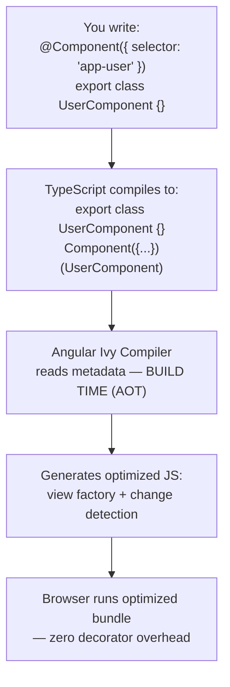
```mermaid
flowchart TD
    A["You write:\n@Component({ selector: 'app-user' })\nexport class UserComponent {}"]
    B["TypeScript compiles to:\nexport class UserComponent {}\nComponent({...})(UserComponent)"]
    C["Angular Ivy Compiler\nreads metadata — BUILD TIME (AOT)"]
    D["Generates optimized JS:\nview factory + change detection"]
    E["Browser runs optimized bundle\n— zero decorator overhead"]

    A --> B --> C --> D --> E
```

```typescript
// What YOU write
@Component({ selector: 'app-user', templateUrl: './user.html' })
export class UserComponent {}

// What TypeScript COMPILES it to (simplified)
export class UserComponent {}
Component({ selector: 'app-user', templateUrl: './user.html' })(UserComponent);
//         ^─── plain function call that attaches metadata to the class
```

#### The Four Decorator Types Angular Uses

| Type | Angular Examples | Applied To | Purpose |
|:--|:--|:--|:--|
| **Class** | `@Component` `@Injectable` `@NgModule` `@Pipe` | Whole class | Registers the class with Angular |
| **Property** | `@Input` `@Output` `@ViewChild` `@ContentChild` | Class field | Marks a field for Angular's data-flow |
| **Parameter** | `@Inject` `@Optional` `@Self` | Constructor param | Overrides DI token resolution |
| **Method** | `@HostListener` | Class method | Binds a DOM event to the method |

```typescript
// CLASS Decorator — registers as injectable service
@Injectable({ providedIn: 'root' })
export class TaskService {}

// PROPERTY Decorator — marks as parent-to-child input
@Input({ required: true }) userId!: string;

// PROPERTY Decorator — marks as child-to-parent event
@Output() taskSelected = new EventEmitter<string>();

// METHOD Decorator — binds Escape key to this method
@HostListener('document:keydown.escape')
onEscape() { this.closeModal(); }
```

> [!NOTE]
> **Why Decorators instead of class inheritance?**
> A class can only `extend` ONE parent. Decorators attach multiple behaviors to any class — component + injectable + route config — without a forced inheritance chain. This is **composition over inheritance**.

#### 🧠 Interview & Mind-Working Questions

**Q: What is a TypeScript Decorator at its core?**
A: A plain function that receives a class as its argument and attaches metadata to it. Angular's Ivy compiler reads this metadata at build time to generate optimized rendering code.

**Q: When does Angular read the `@Component` metadata?**
A: At **build time** (AOT compilation). By the time the browser runs the app, all decorators have been compiled away. There is zero decorator overhead at runtime.

**Q: What happens if you use a component in a template but forget `@Component`?**
A: A build error: `X is not a known element`. Angular does not know the class is a component because no metadata was attached to it.

**Q: Difference between `@Input` and `@Output` as decorator types?**
A: Both are property decorators. `@Input` marks a field the **parent writes into** (data flows IN). `@Output` marks a field the **child emits through** (events flow OUT). The direction is the key difference.

---

### 🏗️ Pattern 3: Singleton — One Service, Whole App

> **Official Reference**: [Angular Docs — Singleton Services](https://angular.dev/guide/di/singleton-services)

The **Singleton** pattern ensures a class has only **one instance** for the entire application lifetime. In Angular, every `providedIn: 'root'` service is a Singleton managed by the root injector.

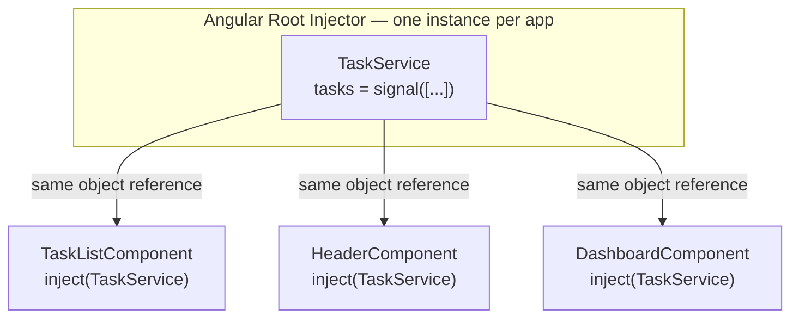
```mermaid
graph TD
    subgraph Root ["Angular Root Injector — one instance per app"]
        TS["TaskService\ntasks = signal([...])"]
    end

    A["TaskListComponent\ninject(TaskService)"]
    B["HeaderComponent\ninject(TaskService)"]
    C["DashboardComponent\ninject(TaskService)"]

    TS -- "same object reference" --> A
    TS -- "same object reference" --> B
    TS -- "same object reference" --> C
```

When one component calls `taskService.addTask()`, the signal updates and **all three components** re-render automatically — they all share the exact same signal reference.

```typescript
// ONE instance for the whole app
@Injectable({ providedIn: 'root' })
export class TaskService {
  private _tasks = signal<Task[]>([]);
  tasks = this._tasks.asReadonly();
}

// Component A and B get the SAME instance
@Component({...}) export class ComponentA {
  private svc = inject(TaskService); // same as ComponentB
}
@Component({...}) export class ComponentB {
  private svc = inject(TaskService); // same as ComponentA
}
```

> [!WARNING]
> Adding `providers: [MyService]` inside `@Component` creates a **NEW scoped instance** per component. It is destroyed when the component is destroyed. Use this intentionally for stateful services that must reset per component lifecycle.

#### 🧠 Interview & Mind-Working Questions

**Q: Why is `providedIn: 'root'` the default for most services?**
A: It creates one shared instance, makes the service tree-shakeable (removed from the bundle if nothing injects it), and avoids declaring it in any module's `providers` array.

**Q: What happens if you declare a service in `providers` of two different modules?**
A: Each module gets its own separate instance. Use `providedIn: 'root'` or a shared module imported only once for a true singleton.

---

### 👁️ Pattern 4: Observer — Signals and EventEmitter

> **Official Reference**: [Angular Docs — Signals](https://angular.dev/guide/signals)

The **Observer** pattern: when a **Subject** changes state, all registered **Observers** are notified automatically. Angular implements this through Signals and EventEmitter.

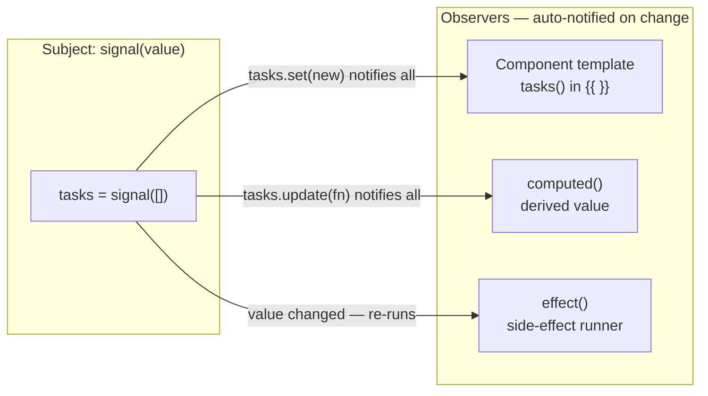
```mermaid
graph LR
    subgraph Subject ["Subject: signal(value)"]
        SIG["tasks = signal([])"]
    end

    subgraph Observers ["Observers — auto-notified on change"]
        O1["Component template\ntasks() in {{ }}"]
        O2["computed()\nderived value"]
        O3["effect()\nside-effect runner"]
    end

    SIG -- "tasks.set(new) notifies all" --> O1
    SIG -- "tasks.update(fn) notifies all" --> O2
    SIG -- "value changed — re-runs" --> O3
```

| Observer API | What it does | When to use |
|:--|:--|:--|
| `signal()` | Writable reactive value (the Subject) | Mutable state — tasks, user, cart |
| `computed()` | Read-only derived value — lazy | Stats, filtered lists, transformations |
| `effect()` | Side-effect runner on signal change | Logging, external sync, localStorage |
| `output()` / `EventEmitter` | One-time event push — not stored | Parent-child communication |

```typescript
tasks = signal<Task[]>([]);

// Observer 1 — recomputes when tasks changes
completedCount = computed(() =>
  this.tasks().filter(t => t.done).length
);

// Observer 2 — side-effect fires when tasks changes
constructor() {
  effect(() => {
    localStorage.setItem('tasks', JSON.stringify(this.tasks()));
  });
}
```

#### 🧠 Interview & Mind-Working Questions

**Q: What is the difference between `computed()` and `effect()`?**
A: `computed()` returns a **value** (use in templates or other computeds). `effect()` runs a **side-effect** with no return value (use for storage, logging, external sync). `computed()` is lazy, `effect()` is eager.

**Q: How is Observer better than calling update functions manually everywhere?**
A: Components declare what they depend on, and Angular notifies automatically. Without Observer, every state change requires manually finding and updating every consumer — brittle and error-prone at scale.

---

### 🏠 Pattern 5: Facade — Services That Hide Complexity

> **Official Reference**: [Angular Docs — Services and DI](https://angular.dev/guide/di)

The **Facade** pattern provides a simple interface to a complex subsystem. An Angular Service acts as a Facade when it hides HTTP calls, caching, error handling, and multiple API endpoints behind a clean API that components call with one line.

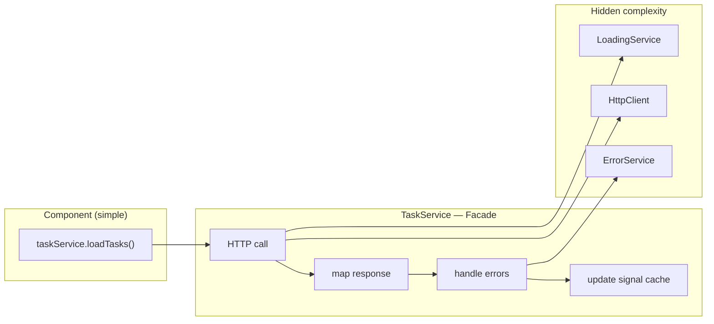
```mermaid
graph LR
    subgraph Comp ["Component (simple)"]
        CO["taskService.loadTasks()"]
    end

    subgraph Facade ["TaskService — Facade"]
        F1["HTTP call"] --> F2["map response"] --> F3["handle errors"] --> F4["update signal cache"]
    end

    subgraph Real ["Hidden complexity"]
        H["HttpClient"]
        E["ErrorService"]
        L["LoadingService"]
    end

    CO --> F1
    F1 --> H
    F3 --> E
    F1 --> L
```

```typescript
// FACADE — component calls ONE simple method
@Injectable({ providedIn: 'root' })
export class TaskService {
  private http = inject(HttpClient);
  private errorService = inject(ErrorService);
  private _tasks = signal<Task[]>([]);
  tasks = this._tasks.asReadonly();

  loadTasks(userId: string): void {
    this.http.get<Task[]>(`/api/users/${userId}/tasks`).pipe(
      map(tasks => tasks.filter(t => !t.archived)),
      catchError(err => {
        this.errorService.show('Failed to load tasks');
        return of([]);
      })
    ).subscribe(tasks => this._tasks.set(tasks));
  }
}

// COMPONENT — one line, no idea about HTTP / caching / errors
@Component({...})
export class TaskListComponent {
  private taskService = inject(TaskService);
  tasks = this.taskService.tasks;

  ngOnInit() { this.taskService.loadTasks('user-1'); }
}
```

#### 🧠 Interview & Mind-Working Questions

**Q: What makes a Service a "Facade"?**
A: When it hides multiple collaborators (HttpClient, ErrorService, CacheService) behind one simple method. The component does not know any collaborator exists.

**Q: Why is the Facade pattern important for testing?**
A: You mock one Facade instead of every collaborator separately. Tests become dramatically simpler.

---

### 🔌 Pattern 6: Strategy — DI as an Implementation Switcher

> **Official Reference**: [Angular Docs — DI Providers](https://angular.dev/guide/di/dependency-injection-providers)

The **Strategy** pattern: define a family of interchangeable algorithms behind one interface. In Angular, the **DI system** is the Strategy switcher — you inject an abstract class and Angular decides which concrete implementation to provide.

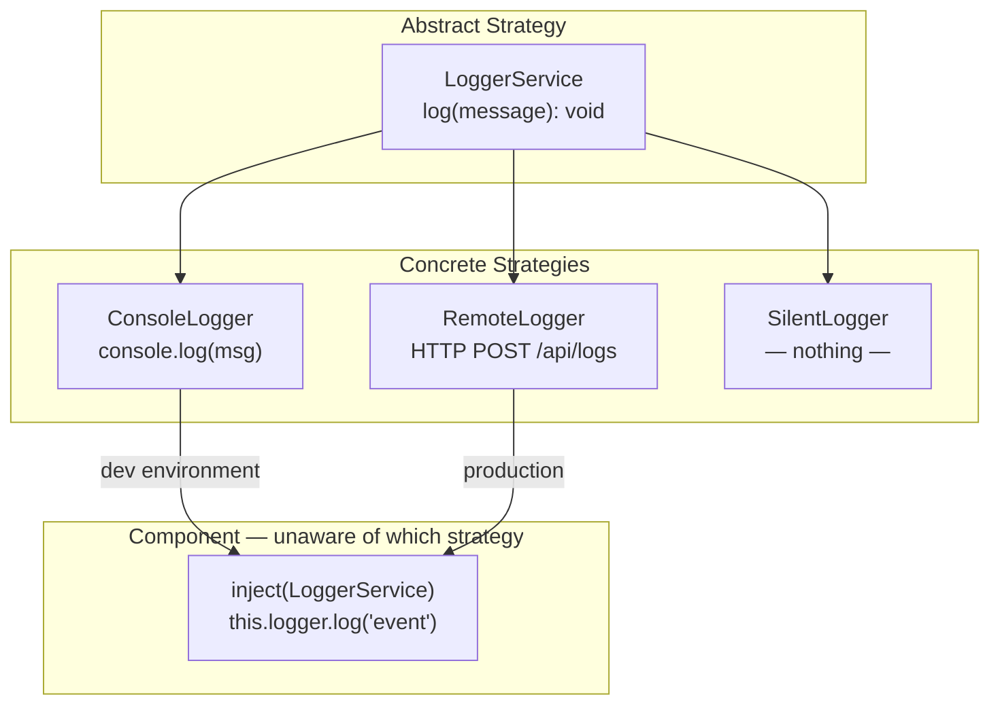
```mermaid
graph TD
    subgraph Iface ["Abstract Strategy"]
        I["LoggerService\nlog(message): void"]
    end
    subgraph Concrete ["Concrete Strategies"]
        A["ConsoleLogger\nconsole.log(msg)"]
        B["RemoteLogger\nHTTP POST /api/logs"]
        C["SilentLogger\n— nothing —"]
    end
    subgraph Consumer ["Component — unaware of which strategy"]
        CO["inject(LoggerService)\nthis.logger.log('event')"]
    end

    I --> A
    I --> B
    I --> C
    A -- "dev environment" --> CO
    B -- "production" --> CO
```

```typescript
// Abstract Strategy
abstract class LoggerService { abstract log(msg: string): void; }

// Concrete Strategy A
@Injectable() class ConsoleLogger extends LoggerService {
  log(msg: string) { console.log('[DEV]', msg); }
}

// Concrete Strategy B
@Injectable() class RemoteLogger extends LoggerService {
  private http = inject(HttpClient);
  log(msg: string) { this.http.post('/api/logs', { msg }).subscribe(); }
}

// DI switches the strategy based on environment
// In app.config.ts:
{ provide: LoggerService, useClass: environment.production ? RemoteLogger : ConsoleLogger }

// Component — never knows WHICH logger it gets
@Component({...}) export class PaymentComponent {
  private logger = inject(LoggerService);
  onPayment() { this.logger.log('Payment initiated'); }
}
```

#### 🧠 Interview & Mind-Working Questions

**Q: How does Angular's DI implement the Strategy pattern?**
A: By letting you `provide` one abstract class but inject a different concrete one using `useClass`, `useValue`, or `useFactory`. The consumer only knows the interface.

**Q: Give a real-world example of Strategy in Angular.**
A: Feature flags — provide a real API service in production and a fake in-memory service in tests. Both implement the same abstract class. The component works identically in both environments.

---

### 🔑 All Six Patterns — Quick Reference

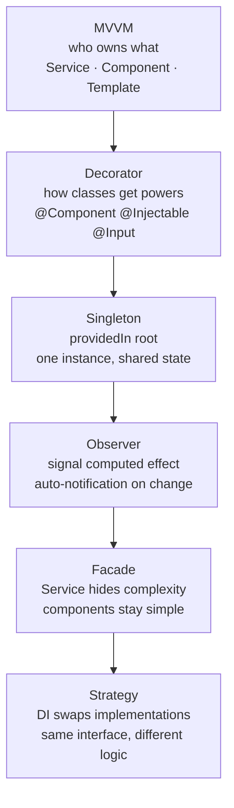
```mermaid
graph TD
    MVVM["MVVM\nwho owns what\nService · Component · Template"]
    DEC["Decorator\nhow classes get powers\n@Component @Injectable @Input"]
    SING["Singleton\nprovidedIn root\none instance, shared state"]
    OBS["Observer\nsignal computed effect\nauto-notification on change"]
    FAC["Facade\nService hides complexity\ncomponents stay simple"]
    STRAT["Strategy\nDI swaps implementations\nsame interface, different logic"]

    MVVM --> DEC --> SING --> OBS --> FAC --> STRAT
```

| Pattern | Angular Implementation | One-Line Rule |
|:--|:--|:--|
| **MVVM** | Service + Component + Template | Data down, events up, model stays pure |
| **Decorator** | `@Component` `@Injectable` `@Input` | Metadata at build time, not runtime |
| **Singleton** | `providedIn: 'root'` | One instance shared by the whole app |
| **Observer** | `signal()` `computed()` `effect()` | Declare dependencies; Angular notifies |
| **Facade** | Service hiding HTTP/cache/errors | One method for the component; all complexity inside |
| **Strategy** | `provide` + `useClass` | Same interface, different implementation per context |

---

## 📚 Course Progress & Learning Path

- [x] **Introduction to Angular**: A TypeScript-based framework by Google for building scalable Single-Page Applications (SPAs).
  ```typescript
  // Example of a basic Angular Component structure
  @Component({
    selector: 'app-root',
    template: `<h1>Hello {{ name }}</h1>`,
  })
  export class AppComponent {
    name = 'Angular';
  }
  ```
- [x] **Angular Architecture**: Organizing apps using components, templates, and services with a focus on modularity and dependency injection.
  ```mermaid
  graph TD
    AppModule --> AppComponent
    AppComponent --> UserComponent
    AppComponent --> TaskService
  ```

### 📁 Project Structure Deep Dive

#### TypeScript Configuration

1. `tsconfig.json`: Global TypeScript compiler configuration.
2. `tsconfig.app.json`: Specific configuration for the Angular application.
3. `tsconfig.spec.json`: Configuration for unit tests.

#### Core Configuration Files

- `angular.json`: The heart of project configuration. Used to define build targets, assets, and global styles/scripts (e.g., Bootstrap, Tailwind CSS).
- `.gitignore`: Specifies files for Git to ignore (e.g., `node_modules`, `.env`).
- `package.json`: Manages project dependencies and scripts.
- `editorconfig`: Maintains consistent coding styles across different editors.

#### Source Directory (`src`)

- `index.html`: The main HTML file where the app is rendered.
- `main.ts`: The entry point that bootstraps the `AppModule` or standalone component.
- `styles.css`: Global application styles.
- `app/`: Contains the core application logic, components, and routing.

---

## 🏗️ Components & Templates

Components are the fundamental building blocks of Angular. Each component typically consists of:

- **Logic**: `component.ts` (Class & Metadata)
- **View**: `component.html` (Structure)
- **Styles**: `component.css` (Look & Feel)
- **Tests**: `component.spec.ts` (Unit Testing)

> [!TIP]
> Use the `@Component` decorator to define a class as an Angular component. It metadata links the logic to the template and styles.

```typescript
import { Component } from '@angular/core';

@Component({
  selector: 'app-user',
  templateUrl: './user.component.html',
  styleUrls: ['./user.component.css'],
  standalone: true,
  imports: [], // Add dependencies here
})
export class UserComponent {
  // Logic goes here
}
```

### 💡 How to use it (Steps)

1.  **Generate**: Use `ng generate component my-component` to create a new one.
2.  **Define Logic**: Add properties to the `.ts` class (e.g., `title = 'My App';`).
3.  **Create View**: Design the UI in the `.html` file (e.g., `<h1>{{ title }}</h1>`).
4.  **Register**: If not standalone, add to a module's `declarations`. If standalone, add to the `imports` of the component that uses it (e.g., `imports: [MyComponent]`).

### 🧠 Interview & Mind-Working Questions

**Q: What are the 4 main parts of a component?**
A: Template (HTML), Styles (CSS), Class (TS Logic), and Metadata (@Component decorator).

**Q: Why do we use a selector?**
A: It acts as a custom HTML tag (e.g., `<app-user>`) so we can place the component anywhere in our app.

### 🛡️ View Encapsulation: Controlling Style Scope

Angular provides three ways to control how styles are applied to a component and whether they affect the rest of the application.

> [!NOTE]
> **ViewEncapsulation** is a TypeScript Enum that contains 3 values: `None`, `ShadowDom`, and `Emulated`.

| Mode          | Effect                                                                 |
| :------------ | :--------------------------------------------------------------------- |
| **None**      | Styles are **Global**. They affect the entire app.                      |
| **ShadowDom** | Styles use the browser's native Shadow DOM. They are fully scoped.    |
| **Emulated**  | **Default**. Angular "emulates" scoping by adding unique attributes. |

#### Example Implementation:
```typescript
@Component({
  selector: 'app-control',
  templateUrl: './control.html',
  styleUrl: './control.css',
  encapsulation: ViewEncapsulation.None, // Styles become global
})
```

### 🧠 Interview & Mind-Working Questions
**Q: What is the default encapsulation in Angular?**
A: `ViewEncapsulation.Emulated`. It ensures styles don't "leak" out of the component while still being compatible with all browsers.

---

### 🏷️ Component Attribute Selectors

Instead of using a component as an HTML tag (e.g., `<app-button>`), you can use it as an **Attribute** on an existing element (e.g., `<button appButton>`).

**Why?** This prevents "Redundant DOM Elements." If you use `<app-button><button>...</button></app-button>`, you have an extra `app-button` tag in the DOM. Using an attribute selector keeps the DOM clean.

```typescript
@Component({
  selector: 'button[appButton], a[appButton]', // Component applies to buttons/links with appButton attribute
  standalone: true,
  template: '<ng-content />',
})
export class ButtonComponent {}
```

**How to use it:**
```html
<button appButton>Click Me</button>
```

---

## 🔄 Data Binding & Interaction

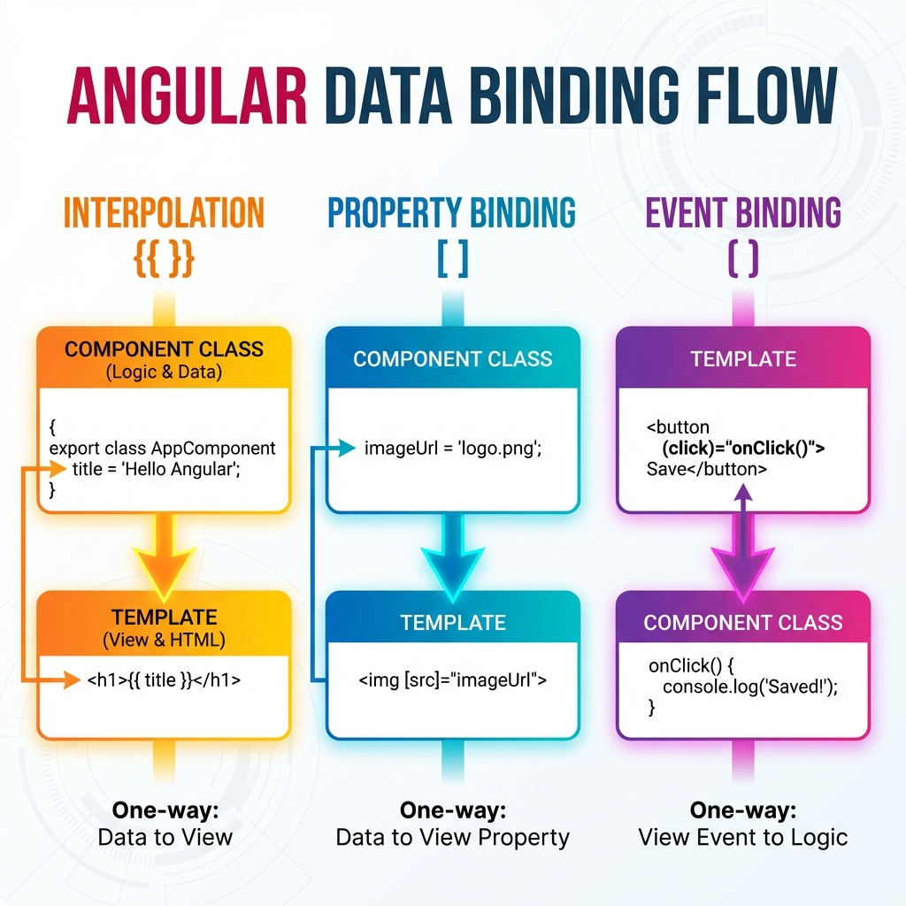

Angular provides powerful ways to sync data between your logic and the UI:

### 1. Interpolation `{{ }}`

Used to display dynamic data from the component class in the HTML template.

```html
<h1>{{ title }}</h1>
```

### 2. Property Binding `[ ]`

Binds a component property to a DOM element attribute or directive.

```html
<h1 [title]="title"></h1>

```

### 3. Event Binding `( )`

Captures user interactions (like clicks) and executes logic in the component.

```html
<button (click)="onSelectUser()">Select User</button>
```

### 4. Getters & Setters in Data Binding

Getters and setters are standard OOP features used to encapsulate logic when reading or writing a property. In Angular, **getters** are incredibly useful for returning computed or dynamic values to the template.

> [!TIP]
> From the template's perspective, a getter is used just like a normal property (no parentheses are needed).

```typescript
export class AppComponent {
  private _userCount = 0;

  // Getter used as a property in HTML
  get userCountDisplay(): string {
    return `Total Users: ${this._userCount}`;
  }
}
```

```html
<!-- No parentheses needed for getters! -->
<h2>{{ userCountDisplay }}</h2>
```

### 💡 How to use Data Binding (Steps)

1.  **Interpolation**: Use `{{ property }}` in HTML (e.g., `<span>{{ username }}</span>`).
2.  **Property Binding**: Use `[attribute]="property"` in HTML (e.g., ``).
3.  **Event Binding**: Use `(event)="method()"` in HTML (e.g., `<button (click)="save()">Save</button>`).
4.  **Getters**: Define `get myValue() { ... }` in TS and use `{{ myValue }}` in HTML.

### 🧠 Interview & Mind-Working Questions

**Q: Difference between `{{ }}` and `[ ]`?**
A: `{{ }}` is for injecting string values into text; `[ ]` is for binding data directly to property values of elements.

**Q: Why do we use parentheses in `(click)`?**
A: Parentheses represent **Output** (events moving from the UI to the Code).

---

## ⚡ Angular Signals & Change Detection


### The Reactive Revolution

Angular uses **Zone.js** by default to detect changes. However, **Signals** (introduced in Angular 16) provide a more granular and efficient way to track state.

> [!NOTE]
> A **Signal** is a "trackable data container" that notifies Angular exactly when its value changes, allowing for targeted UI updates.

> [!NOTE]
> A **Signal** is an object that stores a value (any type of value including nested objects).

> [!NOTE]
> **Angular Reactivity**: Angular manages subscriptions to the signal to get notified about value changes.

> [!NOTE]
> A **Computed Signal** is a "read-only, derived state" that is computed from other signals.

#### Working with Signals

```typescript
import { signal, computed } from '@angular/core';

// 1. Initialize
const userName = signal('Ahmed');

// 2. Update (using previous value)
userName.update((prev) => prev + ' Master');

// 3. Set (direct update)
userName.set('Mohamed');

// 4. Computed Signals (read-only, derived state)
const upperName = computed(() => userName().toUpperCase());
```

### 💡 How to use Signals (Steps)

1.  **Initialize**: Use `signal(initialValue)` (e.g., `count = signal(0);`).
2.  **Read**: Call as a function: `mySignal()` (e.g., `console.log(this.count());`).
3.  **Update**: Use `.set(newValue)` or `.update(prev => ...)` (e.g., `this.count.set(5);`).
4.  **Derive**: Use `computed(() => ...)` (e.g., `double = computed(() => this.count() * 2);`).

### 🧠 Interview & Mind-Working Questions

**Q: Why use `computed()` instead of a normal getter?**
A: Performance! `computed()` is lazily evaluated and memoized (it only re-runs if a signal inside it changes).

**Q: What is a Signal?**
A: A trackable data container that notifies Angular exactly when its value changes, allowing for targeted UI updates.

---

### 📥 Receiving Data: Component Inputs (`@Input` & `input()`)

According to the [Official Angular Documentation](https://angular.dev/guide/components/inputs), inputs allow a parent component to pass data to a child component.

> [!TIP]
> **The Mailbox Analogy 📬**: Think of an `@Input` like a mailbox on a house (the Child). The Parent (the Postman) drops a letter (the data) into the mailbox. The house can't change the mail; it just receives it and reacts to it.

#### 1. The Traditional Way: `@Input()` Decorator

We use the `@Input()` decorator to mark a class field as a property that can receive values from the parent.

```typescript
import { Component, Input } from '@angular/core';

@Component({ ... })
export class ChildComponent {
  // Use '!' to tell TypeScript the value will come from outside
  @Input({ required: true }) name!: string;
  @Input() avatar: string = 'default.png'; // With default value
}
```

**How to pass data in the Parent Template:**

```html
<app-child [name]="currentUserName" [avatar]="userImage" />
```

#### 2. The Modern Way: Signal Inputs (`input()`) ⚡

Introduced in recent Angular versions, Signal inputs are a reactive way to handle data. They are **read-only** signals that notify Angular when the value changes.

```typescript
import { Component, input } from '@angular/core';

export class ChildComponent {
  // Required signal input
  name = input.required<string>();

  // Optional signal input with default value
  avatar = input('default.png');
}
```

**Key Advantages of Signal Inputs:**

- **Reactivity**: Automatically trigger updates in `computed` signals.
- **Type Safety**: Better type inference than decorators.
- **Performance**: More efficient change detection.

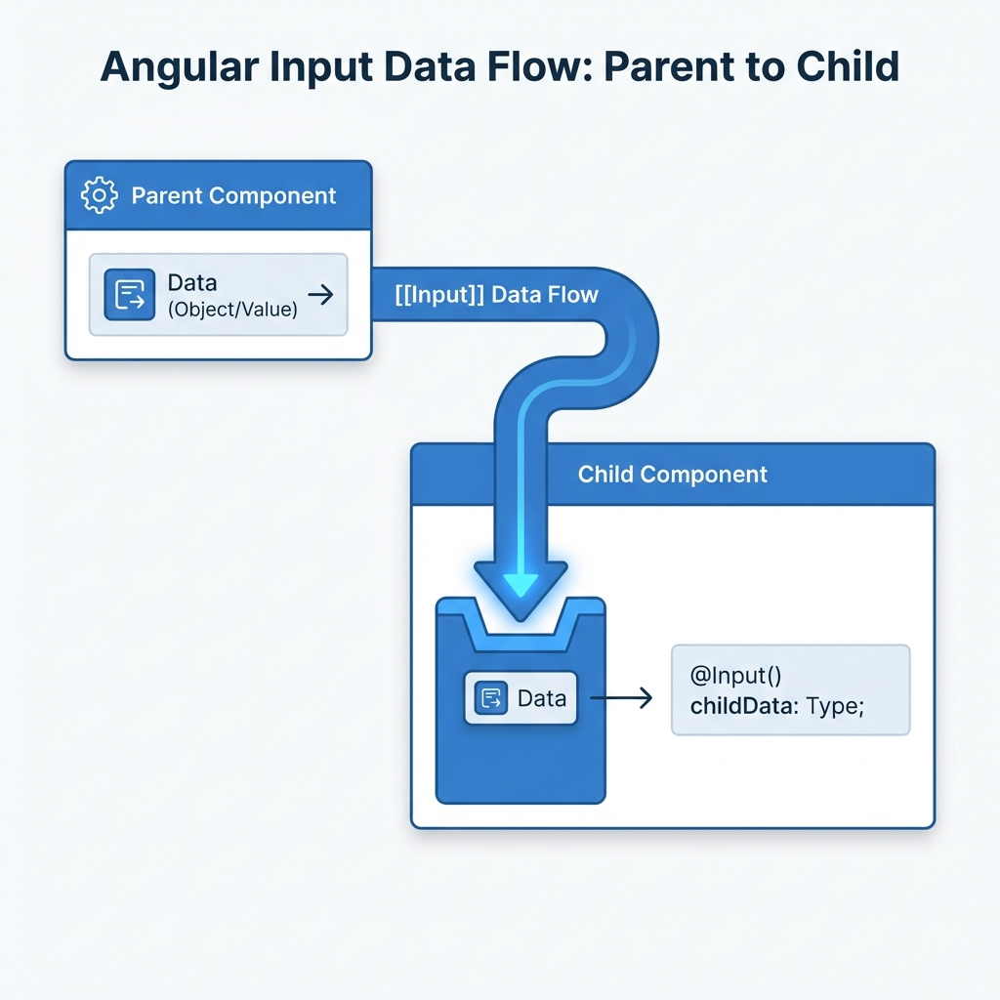
_Data flows from Parent ➡️ Child_

> [!NOTE]
> **Senior Architect's Insight: Signal Inputs**
>
> - **Zoneless Readiness**: Signal inputs are a key building block for removing Zone.js in the future, significantly boosting performance.
> - **Computed Synergy**: You can derive state instantly using `computed(() => 'img/' + this.avatar())` without worrying about change detection cycles.
> - **Read-Only by Design**: Signal inputs are read-only (`Signal<T>`), which enforces the "One-Way Data Flow" principle and prevents accidental state mutations within child components. 🛡️

### 💡 How to use Component Inputs (Steps)

#### **Step 1: In the Child Component (Declare)**

You must tell Angular that this component is ready to receive data.

- **The Modern Signal Way (Recommended)**:
  ```typescript
  // Required input
  userId = input.required<string>();
  // Optional with default
  theme = input('light');
  ```
- **The Traditional Decorator Way**:
  ```typescript
  @Input({ required: true }) userId!: string;
  @Input() theme: string = 'light';
  ```

#### **Step 2: In the Parent Template (Bind)**

The parent "pushes" the data into the child using square brackets `[ ]`.

```html
<!-- We pass the 'currentId' variable into the child's 'userId' input -->
<app-child [userId]="currentId" [theme]="'dark'" />
```

#### **Step 3: In the Child Logic (Access)**

- **Signal**: Call it like a function: `this.userId()`.
- **Decorator**: Use it like a normal variable: `this.userId`.

### 🧠 Interview & Mind-Working Questions

**Q: Why do we use `@Input({ required: true })`?**
A: To ensure the app crashes immediately if a developer forgets to pass essential data, making debugging easier.

**Q: What is the "Mailbox Analogy" for Inputs?**
A: The Parent (Postman) drops data into the Child's (House) mailbox. The Child can't change the mail; it just receives it.

### 📢 Sending Data Back: Component Outputs (`@Output` & `output()`)

Outputs allow a child component to raise events that the parent can listen to.

> [!TIP]
> **The Doorbell Analogy 🔔**: Think of an `@Output` like a doorbell. The Child (the visitor) presses the button (emits an event). The Parent (the homeowner) hears the ring (listens to the event) and decides what to do (executes a function). The visitor doesn't tell the homeowner what to do; they just say "I'm here!" or "Something happened!".

#### 1. The Traditional Way: `@Output()` Decorator

We use `@Output()` with an `EventEmitter` to create a custom event.

```typescript
import { Component, Output, EventEmitter } from '@angular/core';

@Component({ ... })
export class ChildComponent {
  @Output() select = new EventEmitter<string>();

  onButtonClicked() {
    this.select.emit('Some Data'); // Sends data to parent
  }
}
```

**How to listen in the Parent Template:**

```html
<app-child (select)="handleSelection($event)" />
```

> [!TIP]
> **$event** contains the data emitted from the child.

#### 2. The Modern Way: Signal Outputs (`output()`) ⚡

The `output()` function is a simpler, more type-safe alternative to `@Output()`.

```typescript
import { Component, output } from '@angular/core';

export class ChildComponent {
  // Creates an output without needing EventEmitter manually
  select = output<string>();

  onButtonClicked() {
    this.select.emit('New Data');
  }
}
```

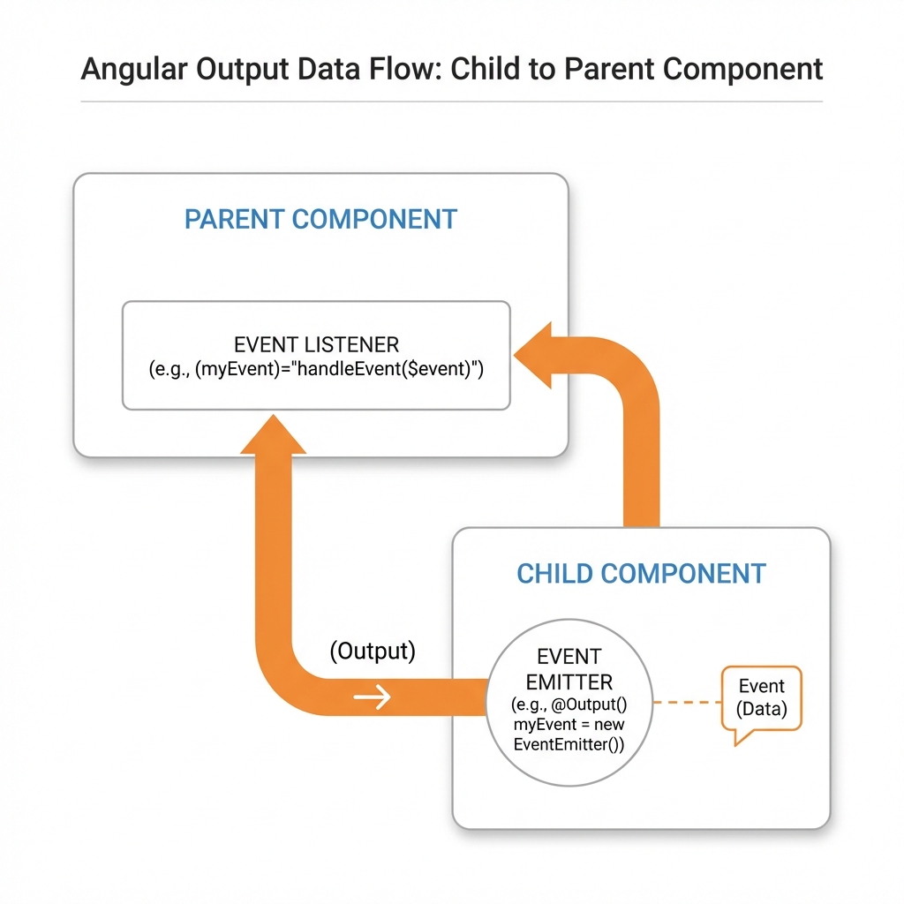
_Events flow from Child ➡️ Parent_

> [!NOTE]
> **Senior Architect's Insight: Output vs EventEmitter**
> While the traditional `@Output()` decorator requires the `EventEmitter` class, the newer `output()` function is leaner and more intuitive. It's not a Signal itself (it doesn't store a value), but it handles the "Bottom-to-Top" event flow with significantly less code and superior type safety.

### 💡 How to use Component Outputs (Steps)

#### **Step 1: In the Child Component (Create & Emit)**

You create a custom event and decide when to "fire" it.

- **The Modern Signal Way (Recommended)**:

  ```typescript
  // 1. Create the output
  select = output<string>();

  // 2. Emit the value in a method
  onUserClick() {
    this.select.emit('some-user-id');
  }
  ```

- **The Traditional Decorator Way**:

  ```typescript
  // 1. Create with EventEmitter
  @Output() select = new EventEmitter<string>();

  onUserClick() {
    this.select.emit('some-user-id');
  }
  ```

#### **Step 2: In the Parent Template (Listen)**

The parent listens for the event using parentheses `( )`.

```html
<!-- We listen for 'select' and call 'handleSelect' in our TS file -->
<app-child (select)="onHandleSelect($event)" />
```

#### **Step 3: In the Parent Logic (Handle)**

Receive the emitted data via the function parameters.

```typescript
onHandleSelect(id: string) {
  console.log('Child emitted:', id);
  // Do logic with the data
}
```

### 🧠 Interview & Mind-Working Questions

**Q: What does `$event` represent?**
A: It is the payload (data) emitted from the child component.

**Q: What is the "Doorbell Analogy" for Outputs?**
A: The Child (Visitor) presses a button. The Parent (Homeowner) hears the ring and decides how to react.

---

### 🔄 Summary: How Data Moves

| Feature    | Direction       | Symbol | Real-life Example                   |
| :--------- | :-------------- | :----- | :---------------------------------- |
| **Input**  | Parent ➡️ Child | `[ ]`  | Postman giving you mail 📬          |
| **Output** | Child ➡️ Parent | `( )`  | Pressing a doorbell to say "Hi!" 🔔 |


_Inputs go IN [ ], Outputs go OUT ( )_

---

#### 4. Transforming Data: Getters vs computed() 🛠️

Sometimes we need to change the data before showing it (like adding a file path to an image name).

| Technique    | Example                                         | Best For                 |
| :----------- | :---------------------------------------------- | :----------------------- |
| **Getter**   | `get path() { return 'img/' + this.avatar; }`   | Classic `@Input`         |
| **Computed** | `path = computed(() => 'img/' + this.avatar())` | Modern `input()` Signals |

**Why `computed()` is better?**
It only runs when its dependencies (the signals inside it) change. A getter runs much more often, which can slow down huge apps! 🐢 -> 🚀

_Data flows from the Parent into the Child "Mailbox"_

---

---

## 🛠️ Senior Implementation Guide: Master Lessons

This section captures the "Senior Notes" embedded throughout our source code, explaining the _why_ behind the _how_.

### 1. Directives vs Components

- **Directives**: Enhance existing elements by adding behavior (like `ngModel`). They **don't** have their own template.
- **Components**: Are actually specialized directives that **do** have their own template.

### 2. Template-Driven Forms: `ngModel` & `ngSubmit` 📝

In Angular, Template-Driven forms are the quickest way to capture user input. We use `[(ngModel)]` for data and `(ngSubmit)` for logic.

#### 🛡️ The Power of `FormsModule`

To use forms, you **must** import `FormsModule` from `@angular/forms`. This module is like a "Toolkit" that gives Angular the power to understand `<form>`, `<input>`, and binding directives.

#### 🚀 Automatic `preventDefault()`

In standard JavaScript, you have to write `event.preventDefault()` to stop the page from reloading when horizontal form is submitted.
**Angular is smarter!** When you use the `(ngSubmit)` directive on a `<form>`, Angular automatically calls `preventDefault()` for you. Your app stays fast and never reloads.

_Analogy: A Two-Way Mirror! Whatever you type reflects in the code, and whatever the code changes reflects in the UI._

### 💡 How to use Angular Forms (Steps)

1.  **Import**: Add `FormsModule` to your component or module imports.
    ```typescript
    imports: [FormsModule];
    ```
2.  **Bind**: Use `[(ngModel)]` on your inputs. **Crucial**: You must also add a `name` attribute!
    ```html
    <input [(ngModel)]="userName" name="username" />
    ```
3.  **Submit**: Use `(ngSubmit)` on the `<form>` tag.
    ```html
    <form (ngSubmit)="onSave()">
      <button>Submit</button>
    </form>
    ```

### 🧠 Interview & Mind-Working Questions

**Q: Why does the page not reload when clicking 'Submit' in an Angular Form?**
A: Because the `(ngSubmit)` directive automatically handles `preventDefault()` under the hood, keeping the application inside its Single-Page Application (SPA) flow.

**Q: Why is the `name` attribute mandatory with `ngModel`?**
A: Angular uses the `name` attribute to register the input control within the internal Form object. Without it, Angular doesn't know which data belongs to which field!

**Q: What happens if you forget to import `FormsModule`?**
A: You will get a "Template Parse Error" saying that `ngModel` is not a known property of `input`.

### 3. State Management & Service Architecture 🏗️

A senior developer centralizes data logic into **Services** to ensure consistency.

_Analogy: A Central Water Tower (Service) providing the same water to all houses (Components)._

- **Dependency Injection (DI)**: A pattern where a service is "injected" into a component rather than created manually.
- **Why?**: Ensures that multiple components share the **exact same instance** of data.
- **Modern Injection**:
  ```typescript
  private taskService = inject(TaskService);
  ```

### 4. Persistence with localStorage 📦

LocalStorage allows us to save data in the user's browser so it doesn't disappear on refresh.

_Analogy: A Treasure Chest in the browser that survives a voyage._

- **Senior Note**: We convert our tasks array into a string using `JSON.stringify` to save it, and `JSON.parse` to retrieve it.

### 5. Advanced Template Features

- **Content Projection (<ng-content>)**: Allows you to create "wrapper" components that can accept and display content from their parent components.
- **Pipes**: Transformers that take a value and return it in a different shape (e.g., `DatePipe`).

### 🏗️ Advanced Content Projection: `<ng-content>` Selectors

Senior developers use **Content Projection** to create flexible "Wrapper" components like cards, modals, or form controls.

#### 1. Multi-Slot Projection with `select`
You can define multiple "slots" in your component where different types of content will be injected.

```html
<!-- In control.html -->
<ng-content select="input, textarea, select, button" />
```

#### 2. Projection Fallbacks
You can provide default content inside `<ng-content>` that will show if no content is projected.

```html
<ng-content>
  <p>Default content if nothing is provided!</p>
</ng-content>
```

#### 3. Advanced Projection with `ngProjectAs`
Sometimes you need to project content into a specific slot even if the element doesn't match the selector. You can use the `ngProjectAs` attribute.

```html
<app-button ngProjectAs="header">Click Me</app-button>
```

### 6. Code Lessons Summary: Implementation Examples

#### **The Service Pattern**

```typescript
@Injectable({ providedIn: 'root' })
export class TaskService {
  private tasks = signal<Task[]>([]);

  addTask(taskData: NewTaskData, userId: string) {
    this.tasks.update((prevTasks) => [
      { id: Math.random().toString(), userId, ...taskData },
      ...prevTasks,
    ]);
  }
}
```

#### **Dependency Injection (Modern)**

```typescript
@Component({ ... })
export class UserTasksComponent {
  private taskService = inject(TaskService); // Senior Clean Code
}
```

#### **localStorage Persistence**

```typescript
// Writing to Storage
localStorage.setItem('tasks', JSON.stringify(this.tasks()));

// Reading from Storage
const savedTasks = localStorage.getItem('tasks');
if (savedTasks) {
  this.tasks.set(JSON.parse(savedTasks));
}
```

### 💡 How to use Services (Steps)

1.  **Generate**: Use `ng generate service my-service`.
2.  **Define State**: Use `signal` to store data (e.g., `tasks = signal([]);`).
3.  **Create Methods**: Add logic: `addTask(t) { this.tasks.update(p => [...p, t]); }`.
4.  **Inject**: Use `private myService = inject(MyService)` in your component.

### 🧠 Interview & Mind-Working Questions

**Q: Why use a Service instead of storing data in a Component?**
A: Services are **Singletons**. If you store data in Component A and navigate away, that data is lost. If you store it in a Service, every component gets the exact same data!

**Q: What is Dependency Injection (DI)?**
A: It's a pattern where Angular "hands" instances of services to components, so the components don't have to create them manually.

---

## 🏗️ Advanced Concepts (Roadmap)

- [x] **Directives**: Enhancing standard HTML elements.
- [x] **Two-Way Binding**: Synchronizing state and UI seamlessly using `[(ngModel)]`.
- [x] **Signals & Computed**: The future of Angular reactivity.
- [ ] **RxJS & Observables**: Mastering async data streams.
- [ ] **Zoneless Change Detection**: The path to ultra-high performance.

---

## 🏁 Part 1: Finished & Roadmap

### 🎯 Part 1 Training Tasks (Professional Challenges):

**Task 1: The Activity Dashboard Mini-App** 📊

- **Goal**: Build an "Activity Overview" section independently of the main list.
- **Requirement**: Use `computed` signals to show "Completion Percentage" and "Total Tasks Count" in real-time.
- **Upwork Context**: Clients often ask for "Analytics Dashboards" to complement basic CRUD apps. This teaches you how to derive multiple states from one source of truth.

**Task 2: The Session Draft Persistent Store** 💾

- **Goal**: Implement a "Draft" feature for the New Task form.
- **Requirement**: If a user types but closes the form without saving, store the text in `localStorage`. When they reopen the form, restore their draft automatically.
- **Company Context**: Professional apps require "Robust UX." Ensuring work isn't lost on accidental clicks or refreshes is a senior-level requirement.

---

## 🛡️ SSR Safety: `isPlatformBrowser`

When building Angular apps with **Server-Side Rendering (SSR)**, your code runs in two places: the **Server** (Node.js) and the **Browser**.

> [!WARNING]
> Objects like `window`, `document`, and `localStorage` **do not exist** on the server. If your code tries to access `localStorage` while rendering on the server, the app will crash! 💥

### How to use it safely:

According to [Angular Common API](https://angular.dev/api/common/isPlatformBrowser), we must check if we are on the browser before using browser-only features.

**Step-by-Step Implementation:**

1.  **Inject PLATFORM_ID**: In constructor or via `inject(PLATFORM_ID)`.
2.  **Import isPlatformBrowser**: From `@angular/common`.
3.  **The Guard**: Wrap code: `if (isPlatformBrowser(this.platformId)) { ... }`.

```typescript
import { inject, PLATFORM_ID } from '@angular/core';
import { isPlatformBrowser } from '@angular/common';

export class MyService {
  private platformId = inject(PLATFORM_ID);

  init() {
    if (isPlatformBrowser(this.platformId)) {
      // ✅ Safe to use localStorage here!
      const data = localStorage.getItem('my-data');
    }
  }
}
```

### 🧠 Interview & Mind-Working Questions

**Q: Why does `localStorage` crash on the Server?**
A: Because there is no browser window/storage in a Node.js server environment.

**Q: What is SSR (Server-Side Rendering)?**
A: It's when Angular generates the HTML on the server first to make the app load faster and improve SEO.

---

## 📝 Step-by-Step: Form Population for "Edit Mode"

When a junior developer sees an "Edit" form, they often wonder: _"How did the data get from the list into these input fields?"_

Here is the professional flow used in this project:

### 1. The Parent Prepares the Data

The parent component knows which task was clicked. It passes that `taskData` and an `isEditing` flag to the child component.

```html
<app-new-task [isEditing]="true" [taskData]="selectedTask" (editTask)="onUpdateTask($event)" />
```

### 2. The Child Listens for Changes (`ngOnChanges`)

In the Child Component (`new-task.ts`), we use the `ngOnChanges` or `ngOnInit` lifecycle hooks to "pre-populate" our local form variables.

```typescript
ngOnChanges(changes: SimpleChanges): void {
  if (this.isEditing && this.taskData) {
    // Fill the variables that are bound to the HTML
    this.enteredTitle = this.taskData.title;
    this.enterdSummary = this.taskData.summary;
    this.enteredDate = this.taskData.date;
  }
}
```

### 3. The HTML Mirrors the Data (`[(ngModel)]`)

Because we use **Two-Way Binding**, the HTML `<input>` automatically shows whatever value is in `enteredTitle`.

```html
<input [(ngModel)]="enteredTitle" name="title" />
```

### 💡 How to populate forms for Edit (Steps)

1.  **Input**: Receive data (e.g., `@Input() taskData!`).
2.  **Lifecycle**: Use `ngOnChanges` to update local variables when the Input changes.
3.  **Assign**: `this.localTitle = this.taskData.title`.
4.  **Bind**: Use `[(ngModel)]="localTitle"` in the HTML template.

### 🧠 Interview & Mind-Working Questions

**Q: Why use `ngOnChanges` instead of just `ngOnInit`?**
A: Because `ngOnInit` only runs once. If the user clicks a different task to edit while the form is already open, we need `ngOnChanges` to update the fields!

> [!TIP]
> This pattern ensures that the form is always "synced". If the parent gives us a new task to edit, `ngOnChanges` fires, updates the variables, and the UI updates instantly! 🔄

---

## 💾 Robust UX: Saving Form Drafts to `localStorage`

A Senior Architect ensures that even if a user accidentally closes a form, their progress isn't lost. This is called **Persistence**.

### The Flow of a Persistent Draft:

1.  **Saving on Close**: When the user clicks "Cancel", we save their current typing into `localStorage` using a unique key (like `draft_task_u1`).

    ```typescript
    localStorage.setItem('draft_task_' + userId, JSON.stringify({ title, summary, date }));
    ```

2.  **Loading on Open**: When the component starts (`ngOnInit`), we check if a draft exists for the current user.
    - **Step 1**: Check if `isPlatformBrowser` is true.
    - **Step 2**: Search for `draft_task_` + the current user's ID.
    - **Step 3**: If found, `JSON.parse` it and assign the values to our form variables.

3.  **Clearing on Success**: Once the user actually clicks "Submit" and the task is saved, we **delete** the draft so it doesn't pop up again.

    ```typescript
    localStorage.removeItem('draft_task_' + userId);
    ```

### 🧠 Interview & Mind-Working Questions

**Q: Why clear the draft on `onSubmit`?**
A: Because the draft is no longer needed once the task is officially saved. Keeping it would cause the old data to reappear next time the form opens!

**Q: Benefit of `JSON.stringify`?**
A: `localStorage` can only store strings. We must convert our objects into strings to save them.

> [!IMPORTANT]
> **Why user-specific keys?**
> If User A types a draft and logs out, User B shouldn't see User A's draft! Using `draft_task_` + `userId` ensures data privacy and a personalized experience. 🛡️

---

---

## 🚦 Senior Mastery: CRUD with Signal Arrays ⚡

Managing arrays in signals requires an **immutable mindset**. According to [Angular Documentation](https://angular.dev/guide/signals), you should never mutate the value inside a signal directly (e.g., `tasks().push()`). Instead, always use `.set()` or `.update()` with a new array reference.

### 1. Create (Add Item)

Use `.update()` to prepend or append a new item using the spread operator.

```typescript
this.tasks.update((prevTasks) => [
  { id: 't4', title: 'New Task' },
  ...prevTasks
]);
```

### 2. Read

Signals are functions. Call them to get the current value.

```typescript
const allTasks = this.tasks();
const specificTasks = this.tasks().filter((t) => t.userId === 'u1');
```

### 3. Update (Modify Item)

Use `.update()` combined with `.map()` to create a new array where only the specific item is changed. This ensures Angular's change detection is triggered correctly.

```typescript
this.tasks.update((tasks) =>
  tasks.map((task) => (task.id === targetId ? { ...task, title: 'Updated Title' } : task)),
);
```

### 4. Delete (Remove Item)

Use `.update()` combined with `.filter()` to create a new array excluding the item.

```typescript
this.tasks.update((tasks) => tasks.filter((task) => task.id !== targetId));
```

> [!IMPORTANT]
> **Why Immutability?**
> Angular Signals rely on reference changes to notify consumers. If you mutate an object inside an array without changing the array's reference, components using the signal might not refresh! Always return a **new array** and **new objects** for the items you change.

---

_Advanced Documentation designed for Senior Growth._

---

## 🎨 Dynamic Styling: Class & Style Binding

Angular provides multiple ways to dynamically apply CSS classes and inline styles to your elements based on the component's state.

### 1. Class Binding `[class]`

Class binding allows you to add or remove CSS classes based on a condition.

- **Single Class**: `[class.name]="condition"`
  ```html
  <div [class.status-offline]="status() === 'offline'"></div>
  ```
- **Multiple Classes (Object Syntax)**:
  ```html
  <div [class]="{
    'status-offline': status() === 'offline',
    'status-online': status() === 'online',
    'active': isActive
  }"></div>
  ```

### 2. Style Binding `[style]`

Style binding allows you to set inline styles dynamically.

- **Single Style**: `[style.property]="value"`
  ```html
  <span [style.color]="status() === 'online' ? 'green' : 'red'">Server Status</span>
  ```
- **Multiple Styles (Object Syntax)**:
  ```html
  <div [style]="{
    'color': status() === 'offline' ? 'red' : 'green',
    'height': '100px',
    'font-weight': isBold ? 'bold' : 'normal'
  }"></div>
  ```

> [!TIP]
> Use the **Object Syntax** when you need to manage multiple related classes or styles at once. It keeps your template much cleaner than multiple individual bindings!

---

## 🏠 Component Host Elements Deep Dive

Every Angular component is associated with a **Host Element**—the custom HTML element that matches the component's selector (e.g., `<app-header>`).

### 1. The Host is Not a Placeholder
Unlike some other frameworks, Angular does **not** replace the custom tag when the page is rendered. Instead, it "takes over" the element and enhances it with logic and a template.

### 2. Styling the Host with `:host`
Inside your component's CSS, use the `:host` selector to apply styles directly to the custom tag itself.

```css
:host {
  display: block;
  border: 1px solid #ccc;
  padding: 1rem;
}
```

### 3. Binding to the Host in `@Component`
You can bind attributes, classes, and events to the host element directly in the component metadata.

```typescript
@Component({
  selector: 'app-control',
  host: {
    'class': 'control-wrapper',
    '(click)': 'onHostClick()'
  }
})
export class ControlComponent {
  onHostClick() { console.log('Host clicked!'); }
}
```

### 4. Direct Host Access: `@HostBinding` & `@HostListener`
For more dynamic control, you can use decorators inside the class:

- **`@HostBinding`**: Binds a property to a host attribute or class.
- **`@HostListener`**: Listens for events on the host element.

```typescript
export class ButtonComponent {
  @HostBinding('class.active') isActive = true;

  @HostListener('mouseenter') 
  onHover() { /* ... */ }
}
```

### 5. Accessing the DOM Programmatically: `ElementRef`
Sometimes you need direct access to the underlying DOM element. You can inject `ElementRef` to get a reference to the host.

```typescript
import { inject, ElementRef } from '@angular/core';

export class MyComponent {
  private hostElement = inject(ElementRef).nativeElement;

  ngOnInit() {
    this.hostElement.focus(); // Example: Manual focus
  }
}
```

> [!CAUTION]
> **Use ElementRef Sparingly!** Direct DOM manipulation can lead to security vulnerabilities (XSS) and issues with Server-Side Rendering (SSR). Always prefer Angular's built-in bindings (`[class]`, `[style]`, etc.) whenever possible.

---

# Part 2: NgModules (The Modular Architecture) 🏗️

In Angular, **NgModules** are like "containers" or "boxes" that organize your code. Even though modern Angular uses **Standalone Components**, understanding Modules is critical for legacy projects and large-scale architecture.

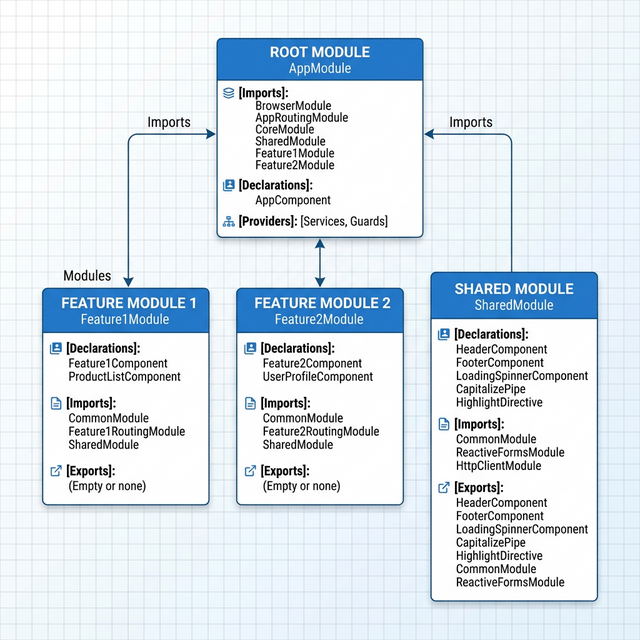

### 🧩 The 5 Divisions of a Module (`@NgModule`)

Think of a Module as a **Team Office**:

1.  **`declarations` (The Team)**: List your internal components, directives, and pipes here.
    - _Example_: `declarations: [UserComponent, HeaderComponent]`
    - _Senior Note_: Components here must have `standalone: false`.
2.  **`imports` (The Tools)**: Other modules or standalone components your module needs.
    - _Example_: `imports: [CommonModule, FormsModule]`
3.  **`exports` (The Storefront)**: What you want other modules to see and use.
    - _Example_: `exports: [UserComponent]`
4.  **`providers` (The Services)**: Data logic (Services) available to this module.
    - _Example_: `providers: [TaskService]`
5.  **`bootstrap` (The Starting Line)**: Only used in the root `AppModule` to tell Angular where to start.
    - _Example_: `bootstrap: [AppComponent]`

---

### 🚀 The Full Module Code Example

```typescript
@NgModule({
  declarations: [HeaderComponent, UserComponent], // Components for the team
  imports: [CommonModule, FormsModule], // Tools needed
  exports: [HeaderComponent], // Publicly visible components
  providers: [TaskService], // Services
  bootstrap: [AppComponent], // Application starting point
})
export class AppModule {}
```

---

### 💡 How to use a Shared Module (Steps)

Based on the `shared.module.ts` in this project:

1.  **Create**: Generate a module: `ng generate module Shared`.
2.  **Declare**: Add reusable components to `declarations: [NewTask, UserTasks, User]`.
3.  **Export**: Add those same components to `exports: [UserTasks, User]`.
4.  **Import**: In your `AppModule`, add `SharedModule` to the `imports: [SharedModule]` array.

---

### 🧠 Interview & Mind-Working Questions

**Q: Difference between `declarations` and `imports`?**
A: `declarations` is for your **own** files (components you wrote). `imports` is for **external** modules or standalone components.

**Q: Why use `exports`?**
A: By default, components in a module are "hidden." You must export them so they can be used as HTML tags in other components' templates.

**Q: Can a component be in two modules?**
A: **No!** A component can only be declared in **one** module. If you need it in two places, move it to a Shared Module and import that module in both places.

---

# 📁 Projects Portfolio: Real-World Applications

This section catalogs the complete applications built during this course, demonstrating how individual Angular concepts come together to solve real business problems.

---

## 🚀 Project 1: Investment Calculator App

A professional tool for projecting financial growth, emphasizing **Signal-based state management** and **Service-oriented logic**.

### 📈 Business Logic: The "How it Works" (Mathematics)

Understanding the business logic is the first step before writing any code. The app calculates **Compound Interest** based on four user inputs:

1.  **Initial Investment**: The starting amount of money.
2.  **Annual Investment**: The amount added every year.
3.  **Expected Return**: The annual interest rate percentage.
4.  **Duration**: How many years the investment will grow.

#### **The Mathematical Formula (Year-by-Year)**
For every year in the duration, the app performs the following calculation:
-   **Interest Earned**: `Current Value * (Expected Return / 100)`
-   **New Value**: `Current Value + Interest Earned + Annual Investment`
-   **Total Interest**: `Current Value - (Annual Investment * Year) - Initial Investment`
-   **Total Invested**: `Initial Investment + (Annual Investment * Year)`

---

### 💻 Code Implementation Deep Dive

We decentralized the logic to ensure the app is scalable and easy to test.

#### **1. The Central "Brain": `investment.service.ts`**
Instead of calculating inside a component, we use a service. **Why?** So any component in the app can access the results without recalculating them.

```typescript
@Injectable({ providedIn: 'root' })
export class InvestmentService {
  annualData = signal<any[]>([]);

  calculateInvestmentResults() {
    let investmentValue = this.initialInvestment();
    const results = [];
    for (let i = 0; i < this.duration(); i++) {
      results.push({ year: i + 1, valueEndOfYear: investmentValue });
    }
    this.annualData.set(results);
  }
}
```

#### **2. Reactive Updates: `update()` vs `set()`**
-   **`set()`**: Replaces the entire array after calculation.
-   **`update()`**: Modifies based on previous state (e.g., adding a single item).

#### **3. Component Communication**
-   **UserInputs Component**: Uses `inject(InvestmentService)` to push new values and trigger `calculate()`.
-   **Results Component**: Reads the `annualData()` signal. Angular handles UI updates automatically.

---

### 🛡️ Senior Architect Review: Why this Architecture?

1.  **Folder Structure (`/projects/`)**: Keeps the main `src` folder clean (Angular Workspace pattern).
2.  **Logic Separation**: Service stays "Dumb" to UI. Code is DRY and Testable.
3.  **Signal Efficiency**: Results table refreshes only when specific data changes.

### 🛡️ Senior Architect Review: Where to Split Components?

1.  **Separation of Concerns (SOLID)**: If a component handles UI + data + math, split it.
2.  **Simplicity & Colocation**: Small projects: keep together. Large apps: split mandatory.
3.  **The Team Standard**: Always follow your team's style guide.

---

# 🔍 Debugging Angular Applications: A Professional Guide

## 1. Tracking Compilation Errors 🚨

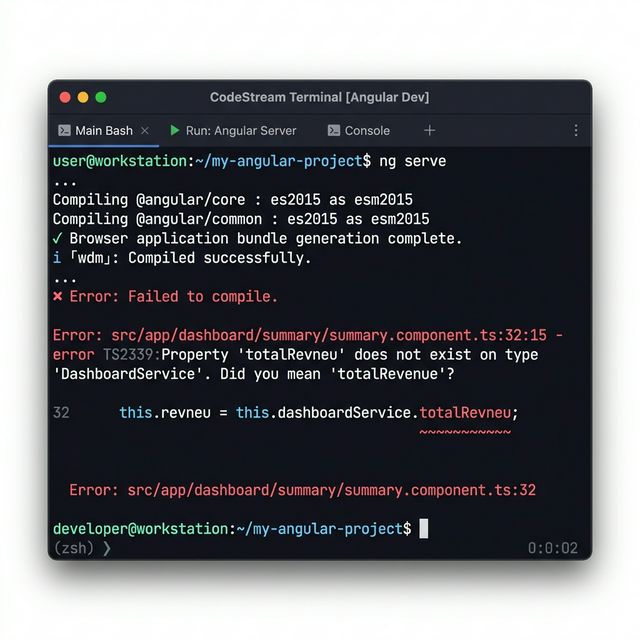

Angular tells you exactly which **Component**, **File**, and **Line Number** has the problem.

## 2. Using the Browser Debugger (Sources Tab) 🛠️

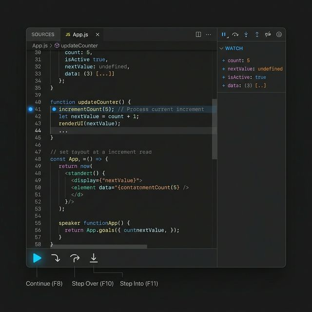

### 💡 How to Debug Logic (Steps):
1.  **Open DevTools**: Press `F12` → **Sources** tab.
2.  **Set a Breakpoint**: Click a line number.
3.  **Inspect Values**: Hover over variables or use the **Watch** window.
4.  **Step-by-Step**: Use the "Next Line" button.

## 3. Angular DevTools Extension 🛡️

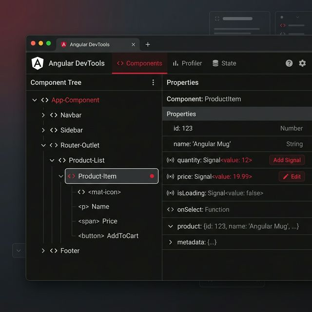

-   **Component Tree**: See component relationships.
-   **Signal Observer**: Watch Signals change in real-time.
-   **State Inspection**: Check component properties without `console.log`.

### 🧠 Interview & Mind-Working Questions

**Q: How do you find a logical error if the app isn't crashing?**
A: Use the browser's **Sources** tab to set a breakpoint and step through the code.

**Q: Why is the Angular DevTools extension useful for Signals?**
A: It lets you observe signal values and manually trigger changes to test reactivity without reloading.

---

_Advanced Documentation designed for Senior Growth._