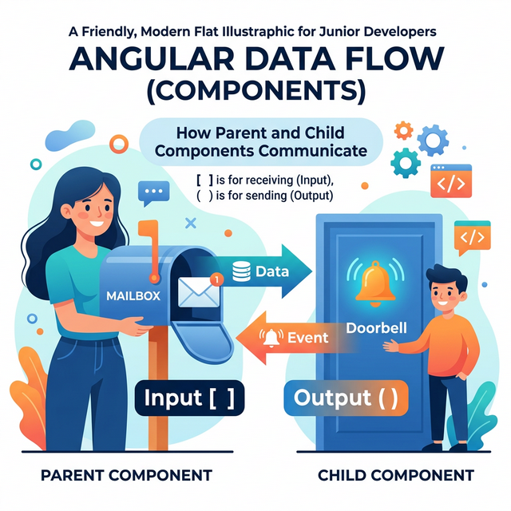

> [!IMPORTANT]
> **Critical Note for AI Assistants**: Never remove or replace old explanations in this file. Always append new data, steps, and pedagogical questions to support the existing content. Preserve the "Senior to Junior" teaching structure.

# Angular Mastery: Senior Architect's Handbook 🚀

> **Part 1: Foundations & Reactive Architecture**

This repository is more than just a course tracker; it's a blueprint for building scalable, enterprise-grade Angular applications. Here, we transition from basic component creation to senior-level architectural patterns, emphasizing **Signals**, **Signal-based I/O**, and **Clean Service Architecture**.


---

## 🗺️ Part 1 Roadmap: The Reactive Core

In this first phase, we focus on mastering the "Reactive Flow." A senior developer doesn't just make things work; they make them **efficient**, **predictable**, and **modular**.

---

---

## 🛠️ Getting Started

This project was generated using [Angular CLI](https://github.com/angular/angular-cli) version 21.1.0.

### Development Server

Run `ng serve` for a dev server. Navigate to `http://localhost:4200/`. The app will automatically reload if you change any of the source files.

### Useful Commands

| Task                   | Command                      |
| :--------------------- | :--------------------------- |
| **Start Server**       | `ng serve`                   |
| **Build Project**      | `ng build`                   |
| **Run Unit Tests**     | `ng test`                    |
| **Run E2E Tests**      | `ng e2e`                     |
| **Generate Component** | `ng generate component name` |

---

## 📚 Course Progress & Learning Path

- [x] **Introduction to Angular**: A TypeScript-based framework by Google for building scalable Single-Page Applications (SPAs).
  ```typescript
  // Example of a basic Angular Component structure
  @Component({
    selector: 'app-root',
    template: `<h1>Hello {{ name }}</h1>`,
  })
  export class AppComponent {
    name = 'Angular';
  }
  ```
- [x] **Angular Architecture**: Organizing apps using components, templates, and services with a focus on modularity and dependency injection.
  ```mermaid
  graph TD
    AppModule --> AppComponent
    AppComponent --> UserComponent
    AppComponent --> TaskService
  ```

### 📁 Project Structure Deep Dive

#### TypeScript Configuration

1. `tsconfig.json`: Global TypeScript compiler configuration.
2. `tsconfig.app.json`: Specific configuration for the Angular application.
3. `tsconfig.spec.json`: Configuration for unit tests.

#### Core Configuration Files

- `angular.json`: The heart of project configuration. Used to define build targets, assets, and global styles/scripts (e.g., Bootstrap, Tailwind CSS).
- `.gitignore`: Specifies files for Git to ignore (e.g., `node_modules`, `.env`).
- `package.json`: Manages project dependencies and scripts.
- `editorconfig`: Maintains consistent coding styles across different editors.

#### Source Directory (`src`)

- `index.html`: The main HTML file where the app is rendered.
- `main.ts`: The entry point that bootstraps the `AppModule` or standalone component.
- `styles.css`: Global application styles.
- `app/`: Contains the core application logic, components, and routing.

---

## 🏗️ Components & Templates

Components are the fundamental building blocks of Angular. Each component typically consists of:

- **Logic**: `component.ts` (Class & Metadata)
- **View**: `component.html` (Structure)
- **Styles**: `component.css` (Look & Feel)
- **Tests**: `component.spec.ts` (Unit Testing)

> [!TIP]
> Use the `@Component` decorator to define a class as an Angular component. It metadata links the logic to the template and styles.

```typescript
import { Component } from '@angular/core';

@Component({
  selector: 'app-user',
  templateUrl: './user.component.html',
  styleUrls: ['./user.component.css'],
  standalone: true,
  imports: [], // Add dependencies here
})
export class UserComponent {
  // Logic goes here
}
```

### 💡 How to use it (Steps)

1.  **Generate**: Use `ng generate component my-component` to create a new one.
2.  **Define Logic**: Add properties and methods to the `.ts` class.
3.  **Create View**: Design the UI in the `.html` file.
4.  **Register**: If not standalone, add to a module's `declarations`. If standalone, add to the `imports` of the component that uses it.

### 🧠 Interview & Mind-Working Questions

**Q: What are the 4 main parts of a component?**
A: Template (HTML), Styles (CSS), Class (TS Logic), and Metadata (@Component decorator).

**Q: Why do we use a selector?**
A: It acts as a custom HTML tag (e.g., `<app-user>`) so we can place the component anywhere in our app.

---

## 🔄 Data Binding & Interaction




Angular provides powerful ways to sync data between your logic and the UI:

### 1. Interpolation `{{ }}`

Used to display dynamic data from the component class in the HTML template.

```html
<h1>{{ title }}</h1>
```

### 2. Property Binding `[ ]`

Binds a component property to a DOM element attribute or directive.

```html
<h1 [title]="title"></h1>

```

### 3. Event Binding `( )`

Captures user interactions (like clicks) and executes logic in the component.

```html
<button (click)="onSelectUser()">Select User</button>
```

### 4. Getters & Setters in Data Binding

Getters and setters are standard OOP features used to encapsulate logic when reading or writing a property. In Angular, **getters** are incredibly useful for returning computed or dynamic values to the template.

> [!TIP]
> From the template's perspective, a getter is used just like a normal property (no parentheses are needed).

```typescript
export class AppComponent {
  private _userCount = 0;

  // Getter used as a property in HTML
  get userCountDisplay(): string {
    return `Total Users: ${this._userCount}`;
  }
}
```

```html
<!-- No parentheses needed for getters! -->
<h2>{{ userCountDisplay }}</h2>
```

### 💡 How to use Data Binding (Steps)

1.  **Interpolation**: Use `{{ property }}` in HTML to show simple text.
2.  **Property Binding**: Use `[attribute]="property"` to control HTML attributes (like `src` or `disabled`).
3.  **Event Binding**: Use `(event)="method()"` to trigger logic when a user interacts.
4.  **Getters**: Define `get myValue() { ... }` in TS to return a dynamic result, then use `{{ myValue }}` in HTML.

### 🧠 Interview & Mind-Working Questions

**Q: Difference between `{{ }}` and `[ ]`?**
A: `{{ }}` is for injecting string values into text; `[ ]` is for binding data directly to property values of elements.

**Q: Why do we use parentheses in `(click)`?**
A: Parentheses represent **Output** (events moving from the UI to the Code).

---

## ⚡ Angular Signals & Change Detection


### The Reactive Revolution

Angular uses **Zone.js** by default to detect changes. However, **Signals** (introduced in Angular 16) provide a more granular and efficient way to track state.

> [!NOTE]
> A **Signal** is a "trackable data container" that notifies Angular exactly when its value changes, allowing for targeted UI updates.

> [!NOTE]
> A **Signal** is an object that stores a value (any type of value including nested objects).

> [!NOTE]
> **Angular Reactivity**: Angular manages subscriptions to the signal to get notified about value changes.

> [!NOTE]
> A **Computed Signal** is a "read-only, derived state" that is computed from other signals.

#### Working with Signals

```typescript
import { signal, computed } from '@angular/core';

// 1. Initialize
const userName = signal('Ahmed');

// 2. Update (using previous value)
userName.update((prev) => prev + ' Master');

// 3. Set (direct update)
userName.set('Mohamed');

// 4. Computed Signals (read-only, derived state)
const upperName = computed(() => userName().toUpperCase());
```

### 💡 How to use Signals (Steps)

1.  **Initialize**: Use `signal(initialValue)` for mutable state.
2.  **Read**: Call the signal as a function: `mySignal()`.
3.  **Update**: Use `.set(newValue)` for direct changes or `.update(prev => ...)` for changes based on the old value.
4.  **Derive**: Use `computed(() => ...)` to create a reactive, read-only value from other signals.

### 🧠 Interview & Mind-Working Questions

**Q: Why use `computed()` instead of a normal getter?**
A: Performance! `computed()` is lazily evaluated and memoized (it only re-runs if a signal inside it changes).

**Q: What is a Signal?**
A: A trackable data container that notifies Angular exactly when its value changes, allowing for targeted UI updates.

---

### 📥 Receiving Data: Component Inputs (`@Input` & `input()`)

According to the [Official Angular Documentation](https://angular.dev/guide/components/inputs), inputs allow a parent component to pass data to a child component.

> [!TIP]
> **The Mailbox Analogy 📬**: Think of an `@Input` like a mailbox on a house (the Child). The Parent (the Postman) drops a letter (the data) into the mailbox. The house can't change the mail; it just receives it and reacts to it.

#### 1. The Traditional Way: `@Input()` Decorator

We use the `@Input()` decorator to mark a class field as a property that can receive values from the parent.

```typescript
import { Component, Input } from '@angular/core';

@Component({ ... })
export class ChildComponent {
  // Use '!' to tell TypeScript the value will come from outside
  @Input({ required: true }) name!: string;
  @Input() avatar: string = 'default.png'; // With default value
}
```

**How to pass data in the Parent Template:**

```html
<app-child [name]="currentUserName" [avatar]="userImage" />
```

#### 2. The Modern Way: Signal Inputs (`input()`) ⚡

Introduced in recent Angular versions, Signal inputs are a reactive way to handle data. They are **read-only** signals that notify Angular when the value changes.

```typescript
import { Component, input } from '@angular/core';

export class ChildComponent {
  // Required signal input
  name = input.required<string>();

  // Optional signal input with default value
  avatar = input('default.png');
}
```

**Key Advantages of Signal Inputs:**

- **Reactivity**: Automatically trigger updates in `computed` signals.
- **Type Safety**: Better type inference than decorators.
- **Performance**: More efficient change detection.


_Data flows from Parent ➡️ Child_

> [!NOTE]
> **Senior Architect's Insight: Signal Inputs**
>
> - **Zoneless Readiness**: Signal inputs are a key building block for removing Zone.js in the future, significantly boosting performance.
> - **Computed Synergy**: You can derive state instantly using `computed(() => 'img/' + this.avatar())` without worrying about change detection cycles.
> - **Read-Only by Design**: Signal inputs are read-only (`Signal<T>`), which enforces the "One-Way Data Flow" principle and prevents accidental state mutations within child components. 🛡️

### 💡 How to use Component Inputs (Steps)

1.  **Declare**: In the Child Component, use `@Input() property!` or `property = input.required<type>()`.
2.  **Bind**: In the Parent Template, use `[property]="codeVariable"`.
3.  **Use**: In the Child Logic, access it as a normal variable (or signal).

### 🧠 Interview & Mind-Working Questions

**Q: Why do we use `@Input({ required: true })`?**
A: To ensure the app crashes immediately if a developer forgets to pass essential data, making debugging easier.

**Q: What is the "Mailbox Analogy" for Inputs?**
A: The Parent (Postman) drops data into the Child's (House) mailbox. The Child can't change the mail; it just receives it.

### 📢 Sending Data Back: Component Outputs (`@Output` & `output()`)

Outputs allow a child component to raise events that the parent can listen to.

> [!TIP]
> **The Doorbell Analogy 🔔**: Think of an `@Output` like a doorbell. The Child (the visitor) presses the button (emits an event). The Parent (the homeowner) hears the ring (listens to the event) and decides what to do (executes a function). The visitor doesn't tell the homeowner what to do; they just say "I'm here!" or "Something happened!".

#### 1. The Traditional Way: `@Output()` Decorator

We use `@Output()` with an `EventEmitter` to create a custom event.

```typescript
import { Component, Output, EventEmitter } from '@angular/core';

@Component({ ... })
export class ChildComponent {
  @Output() select = new EventEmitter<string>();

  onButtonClicked() {
    this.select.emit('Some Data'); // Sends data to parent
  }
}
```

**How to listen in the Parent Template:**

```html
<app-child (select)="handleSelection($event)" />
```

> [!TIP]
> **$event** contains the data emitted from the child.

#### 2. The Modern Way: Signal Outputs (`output()`) ⚡

The `output()` function is a simpler, more type-safe alternative to `@Output()`.

```typescript
import { Component, output } from '@angular/core';

export class ChildComponent {
  // Creates an output without needing EventEmitter manually
  select = output<string>();

  onButtonClicked() {
    this.select.emit('New Data');
  }
}
```


_Events flow from Child ➡️ Parent_

> [!NOTE]
> **Senior Architect's Insight: Output vs EventEmitter**
> While the traditional `@Output()` decorator requires the `EventEmitter` class, the newer `output()` function is leaner and more intuitive. It’s not a Signal itself (it doesn't store a value), but it handles the "Bottom-to-Top" event flow with significantly less code and superior type safety.

### 💡 How to use Component Outputs (Steps)

1.  **Create**: In the Child, use `@Output() myEvent = new EventEmitter()` or `myEvent = output()`.
2.  **Emit**: Trigger `this.myEvent.emit(data)` inside a method (like `onButtonClick`).
3.  **Listen**: In the Parent Template, use `(myEvent)="handleMethod($event)"`.

### 🧠 Interview & Mind-Working Questions

**Q: What does `$event` represent?**
A: It is the payload (data) emitted from the child component.

**Q: What is the "Doorbell Analogy" for Outputs?**
A: The Child (Visitor) presses a button. The Parent (Homeowner) hears the ring and decides how to react.

---

### 🔄 Summary: How Data Moves

| Feature    | Direction       | Symbol | Real-life Example                   |
| :--------- | :-------------- | :----- | :---------------------------------- |
| **Input**  | Parent ➡️ Child | `[ ]`  | Postman giving you mail 📬          |
| **Output** | Child ➡️ Parent | `( )`  | Pressing a doorbell to say "Hi!" 🔔 |


_Inputs go IN [ ], Outputs go OUT ( )_

---

#### 4. Transforming Data: Getters vs computed() 🛠️

Sometimes we need to change the data before showing it (like adding a file path to an image name).

| Technique    | Example                                         | Best For                 |
| :----------- | :---------------------------------------------- | :----------------------- |
| **Getter**   | `get path() { return 'img/' + this.avatar; }`   | Classic `@Input`         |
| **Computed** | `path = computed(() => 'img/' + this.avatar())` | Modern `input()` Signals |

**Why `computed()` is better?**
It only runs when its dependencies (the signals inside it) change. A getter runs much more often, which can slow down huge apps! 🐢 -> 🚀


_Data flows from the Parent into the Child "Mailbox"_

---

---

## 🛠️ Senior Deep Dive: Code Lessons from Part 1

This section captures the "Senior Notes" embedded throughout our source code, explaining the _why_ behind the _how_.

### 1. Directives vs Components

- **Directives**: Enhance existing elements by adding behavior (like `ngModel`). They **don't** have their own template.
- **Components**: Are actually specialized directives that **do** have their own template.

### 2. Two-Way Binding with `[(ngModel)]` 🔄

Used to synchronize data between the logic (TypeScript) and the UI (HTML) in real-time.


_Analogy: A Mirror! Whatever changes in the code reflects in the UI, and vice versa._

- **Requirement**: Must import `FormsModule` from `@angular/forms`.
- **Behavior**: Automatically prevents the default browser behavior of sending a form request to the server and redirecting (SPA behavior).
- **Signal Two-Way Binding**: You can use Signals with `[(ngModel)]` just like normal properties.
  ```html
  [(ngModel)]="title"
  <!-- Correct! -->
  [(ngModel)]="title()"
  <!-- ERROR! Don't use parentheses here -->
  ```

### 3. State Management & Service Architecture 🏗️

A senior developer centralizes data logic into **Services** to ensure consistency.


_Analogy: A Central Water Tower (Service) providing the same water to all houses (Components)._

- **Dependency Injection (DI)**: A pattern where a service is "injected" into a component rather than created manually.
- **Why?**: Ensures that multiple components share the **exact same instance** of data.
- **Modern Injection**:
  ```typescript
  private taskService = inject(TaskService);
  ```

### 4. Persistence with localStorage 📦

LocalStorage allows us to save data in the user's browser so it doesn't disappear on refresh.


_Analogy: A Treasure Chest in the browser that survives a voyage._

- **Senior Note**: We convert our tasks array into a string using `JSON.stringify` to save it, and `JSON.parse` to retrieve it.

### 5. Advanced Template Features

- **Content Projection (<ng-content>)**: Allows you to create "wrapper" components that can accept and display content from their parent components.
- **Pipes**: Transformers that take a value and return it in a different shape (e.g., `DatePipe`).

### 6. Code Lessons Summary: Implementation Examples

#### **The Service Pattern**

```typescript
@Injectable({ providedIn: 'root' })
export class TaskService {
  private tasks = signal<Task[]>([]);

  addTask(taskData: NewTaskData, userId: string) {
    this.tasks.update((prevTasks) => [
      { id: Math.random().toString(), userId, ...taskData },
      ...prevTasks,
    ]);
  }
}
```

#### **Dependency Injection (Modern)**

```typescript
@Component({ ... })
export class UserTasksComponent {
  private taskService = inject(TaskService); // Senior Clean Code
}
```

#### **localStorage Persistence**

```typescript
// Writing to Storage
localStorage.setItem('tasks', JSON.stringify(this.tasks()));

// Reading from Storage
const savedTasks = localStorage.getItem('tasks');
if (savedTasks) {
  this.tasks.set(JSON.parse(savedTasks));
}
```

### 💡 How to use Services (Steps)

1.  **Generate**: Use `ng generate service my-service`.
2.  **Define State**: Use `signal` to store data.
3.  **Create Methods**: Add logic to modify the state (e.g., `addTask`, `removeTask`).
4.  **Inject**: Use `private myService = inject(MyService)` in your component.

### 🧠 Interview & Mind-Working Questions

**Q: Why use a Service instead of storing data in a Component?**
A: Services are **Singletons**. If you store data in Component A and navigate away, that data is lost. If you store it in a Service, every component gets the exact same data!

**Q: What is Dependency Injection (DI)?**
A: It's a pattern where Angular "hands" instances of services to components, so the components don't have to create them manually.

---

## 🏗️ Advanced Concepts (Roadmap)

- [x] **Directives**: Enhancing standard HTML elements.
- [x] **Two-Way Binding**: Synchronizing state and UI seamlessly using `[(ngModel)]`.
- [x] **Signals & Computed**: The future of Angular reactivity.
- [ ] **RxJS & Observables**: Mastering async data streams.
- [ ] **Zoneless Change Detection**: The path to ultra-high performance.

---

## 🏁 Part 1: Finished & Roadmap

### 🎯 Part 1 Training Tasks (Professional Challenges):

**Task 1: The Activity Dashboard Mini-App** 📊

- **Goal**: Build an "Activity Overview" section independently of the main list.
- **Requirement**: Use `computed` signals to show "Completion Percentage" and "Total Tasks Count" in real-time.
- **Upwork Context**: Clients often ask for "Analytics Dashboards" to complement basic CRUD apps. This teaches you how to derive multiple states from one source of truth.

**Task 2: The Session Draft Persistent Store** 💾

- **Goal**: Implement a "Draft" feature for the New Task form.
- **Requirement**: If a user types but closes the form without saving, store the text in `localStorage`. When they reopen the form, restore their draft automatically.
- **Company Context**: Professional apps require "Robust UX." Ensuring work isn't lost on accidental clicks or refreshes is a senior-level requirement.

---

## 🛡️ SSR Safety: `isPlatformBrowser`

When building Angular apps with **Server-Side Rendering (SSR)**, your code runs in two places: the **Server** (Node.js) and the **Browser**.

> [!WARNING]
> Objects like `window`, `document`, and `localStorage` **do not exist** on the server. If your code tries to access `localStorage` while rendering on the server, the app will crash! 💥

### How to use it safely:

According to [Angular Common API](https://angular.dev/api/common/isPlatformBrowser), we must check if we are on the browser before using browser-only features.

**Step-by-Step Implementation:**

1.  **Inject PLATFORM_ID**: This tells Angular which platform is currently running the code.
2.  **Import isPlatformBrowser**: A utility function from `@angular/common`.
3.  **The Guard**: Wrap your browser-only code in an `if` statement.

```typescript
import { inject, PLATFORM_ID } from '@angular/core';
import { isPlatformBrowser } from '@angular/common';

export class MyService {
  private platformId = inject(PLATFORM_ID);

  init() {
    if (isPlatformBrowser(this.platformId)) {
      // ✅ Safe to use localStorage here!
      const data = localStorage.getItem('my-data');
    }
  }
}
```

### 🧠 Interview & Mind-Working Questions

**Q: Why does `localStorage` crash on the Server?**
A: Because there is no browser window/storage in a Node.js server environment.

**Q: What is SSR (Server-Side Rendering)?**
A: It's when Angular generates the HTML on the server first to make the app load faster and improve SEO.

---

## 📝 Step-by-Step: Form Population for "Edit Mode"

When a junior developer sees an "Edit" form, they often wonder: _"How did the data get from the list into these input fields?"_

Here is the professional flow used in this project:

### 1. The Parent Prepares the Data

The parent component knows which task was clicked. It passes that `taskData` and an `isEditing` flag to the child component.

```html
<app-new-task [isEditing]="true" [taskData]="selectedTask" (editTask)="onUpdateTask($event)" />
```

### 2. The Child Listens for Changes (`ngOnChanges`)

In the Child Component (`new-task.ts`), we use the `ngOnChanges` or `ngOnInit` lifecycle hooks to "pre-populate" our local form variables.

```typescript
ngOnChanges(changes: SimpleChanges): void {
  if (this.isEditing && this.taskData) {
    // Fill the variables that are bound to the HTML
    this.enteredTitle = this.taskData.title;
    this.enterdSummary = this.taskData.summary;
    this.enteredDate = this.taskData.date;
  }
}
```

### 3. The HTML Mirrors the Data (`[(ngModel)]`)

Because we use **Two-Way Binding**, the HTML `<input>` automatically shows whatever value is in `enteredTitle`.

```html
<input [(ngModel)]="enteredTitle" name="title" />
```

### 💡 How to populate forms for Edit (Steps)

1.  **Input**: Receive `taskData` from the parent.
2.  **Lifecycle**: Use `ngOnChanges` to detect when the data arrives.
3.  **Assign**: Set local variables (like `enteredTitle`) to equal the data from the input.
4.  **Bind**: Ensure the variables are connected to the HTML via `[(ngModel)]`.

### 🧠 Interview & Mind-Working Questions

**Q: Why use `ngOnChanges` instead of just `ngOnInit`?**
A: Because `ngOnInit` only runs once. If the user clicks a different task to edit while the form is already open, we need `ngOnChanges` to update the fields!

> [!TIP]
> This pattern ensures that the form is always "synced". If the parent gives us a new task to edit, `ngOnChanges` fires, updates the variables, and the UI updates instantly! 🔄

---

## 💾 Robust UX: Saving Form Drafts to `localStorage`

A Senior Architect ensures that even if a user accidentally closes a form, their progress isn't lost. This is called **Persistence**.

### The Flow of a Persistent Draft:

1.  **Saving on Close**: When the user clicks "Cancel", we save their current typing into `localStorage` using a unique key (like `draft_task_u1`).

    ```typescript
    localStorage.setItem('draft_task_' + userId, JSON.stringify({ title, summary, date }));
    ```

2.  **Loading on Open**: When the component starts (`ngOnInit`), we check if a draft exists for the current user.
    - **Step 1**: Check if `isPlatformBrowser` is true.
    - **Step 2**: Search for `draft_task_` + the current user's ID.
    - **Step 3**: If found, `JSON.parse` it and assign the values to our form variables.

3.  **Clearing on Success**: Once the user actually clicks "Submit" and the task is saved, we **delete** the draft so it doesn't pop up again.

    ```typescript
    localStorage.removeItem('draft_task_' + userId);
    ```

### 🧠 Interview & Mind-Working Questions

**Q: Why clear the draft on `onSubmit`?**
A: Because the draft is no longer needed once the task is officially saved. Keeping it would cause the old data to reappear next time the form opens!

**Q: Benefit of `JSON.stringify`?**
A: `localStorage` can only store strings. We must convert our objects into strings to save them.

> [!IMPORTANT]
> **Why user-specific keys?**
> If User A types a draft and logs out, User B shouldn't see User A's draft! Using `draft_task_` + `userId` ensures data privacy and a personalized experience. 🛡️

---

---

## 🚦 Senior Mastery: CRUD with Signal Arrays ⚡

Managing arrays in signals requires an **immutable mindset**. According to [Angular Documentation](https://angular.dev/guide/signals), you should never mutate the value inside a signal directly (e.g., `tasks().push()`). Instead, always use `.set()` or `.update()` with a new array reference.

### 1. Create (Add Item)

Use `.update()` to prepend or append a new item using the spread operator.

```typescript
this.tasks.update((prevTasks) => [
  { id: 't4', title: 'New Task', ... },
  ...prevTasks
]);
```

### 2. Read

Signals are functions. Call them to get the current value.

```typescript
const allTasks = this.tasks();
const specificTasks = this.tasks().filter((t) => t.userId === 'u1');
```

### 3. Update (Modify Item)

Use `.update()` combined with `.map()` to create a new array where only the specific item is changed. This ensures Angular's change detection is triggered correctly.

```typescript
this.tasks.update((tasks) =>
  tasks.map((task) => (task.id === targetId ? { ...task, title: 'Updated Title' } : task)),
);
```

### 4. Delete (Remove Item)

Use `.update()` combined with `.filter()` to create a new array excluding the item.

```typescript
this.tasks.update((tasks) => tasks.filter((task) => task.id !== targetId));
```

> [!IMPORTANT]
> **Why Immutability?**
> Angular Signals rely on reference changes to notify consumers. If you mutate an object inside an array without changing the array's reference, components using the signal might not refresh! Always return a **new array** and **new objects** for the items you change.

---

---

## 🎓 Study Notes: Services & Dependency Injection (DI)

These notes were extracted from component logic to provide a clear architectural overview of how Angular handles data and dependencies.

### 1. Creating a Service

Services are centralized classes for data logic. Use the CLI to generate them:
`ng generate service <name>`

### 2. Dependency Injection (DI) Patterns

DI is a design pattern used to inject services into components. There are two modern ways:

#### A. Constructor Injection

```typescript
constructor(private taskService: TaskService) {
  // Access data immediately
  this.tasks = this.taskService.getUserTasks(this.userId);
}
```

#### B. The `inject()` Function (Modern Clean Code)

```typescript
import { inject } from '@angular/core';
private taskService = inject(TaskService);
```

> [!IMPORTANT]
> **Singleton vs. Scoped Service**
> Using `providedIn: 'root'` ensures the service is a **Singleton** (shared instance). If you create a new instance manually with `new TaskService()`, components will NOT share data!

### 3. Directives & Components

- **Directives**: Enhance standard HTML elements with behavior (e.g., `ngModel`). They **don't** have templates.
- **Components**: Specialized directives **with** templates.

### 4. Two-Way Data Binding

Use `[(ngModel)]` to sync state between logic (TS) and UI (HTML).

- **Requirement**: Import `FormsModule`.
- **Note**: With Signals, use `[(ngModel)]="mySignal"`, **not** `mySignal()`.

---

_Advanced Documentation designed for Senior Growth._

---

# Part 2: NgModules (The Modular Architecture) 🏗️

In Angular, **NgModules** are like "containers" or "boxes" that organize your code. Even though modern Angular uses **Standalone Components**, understanding Modules is critical for legacy projects and large-scale architecture.


### 🧩 The 5 Divisions of a Module (`@NgModule`)

Think of a Module as a **Team Office**:

1.  **`declarations` (The Team)**: Every component, directive, or pipe that "lives" in this module must be listed here.
    - _Senior Note_: Components here must have `standalone: false`.
2.  **`imports` (The Tools)**: Other modules or standalone components that your team needs to do their job (e.g., `FormsModule`).
3.  **`exports` (The Storefront)**: What you want other modules to see. If it's not exported, it's private to this module! 🔒
4.  **`providers` (The Services)**: Centralized data logic (Services) available to the team.
5.  **`bootstrap` (The Starting Line)**: Only used in the main `AppModule`. It tells Angular which component to start with (usually `App`).

---

### 🚀 Benefits of Using Modules

- **Division of Labor**: Different developers can work on different modules (e.g., `AuthModule`, `DashboardModule`).
- **Lazy Loading**: You can tell Angular: _"Don't load the Admin code until the user actually clicks the Admin link!"_ This makes the app much faster. 🏎️
- **Organization**: Keeps your `AppModule` from becoming a "Giant Spaghetti Monster." 🍝

---

### 💡 How to use a Shared Module (Steps)

Based on the `shared.module.ts` in this project:

1.  **Create**: Generate a module: `ng generate module Shared`.
2.  **Declare**: Add reusable components (like `UserTasks`, `User`) to `declarations`.
3.  **Export**: Add those same components to `exports` so other modules can use them.
4.  **Import**: In your `AppModule`, simply add `SharedModule` to the `imports` array.

---

### 🧠 Interview & Mind-Working Questions

**Q: Difference between `declarations` and `imports`?**
A: `declarations` is for your **own** files (components you wrote). `imports` is for **external** modules or standalone components.

**Q: Why use `exports`?**
A: By default, components in a module are "hidden." You must export them so they can be used as HTML tags in other components' templates.

**Q: Can a component be in two modules?**
A: **No!** A component can only be declared in **one** module. If you need it in two places, move it to a Shared Module and import that module in both places.

---

_Advanced Documentation designed for Senior Growth._
